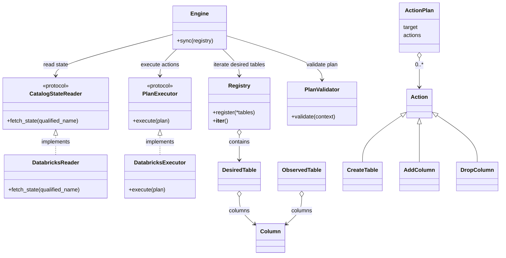
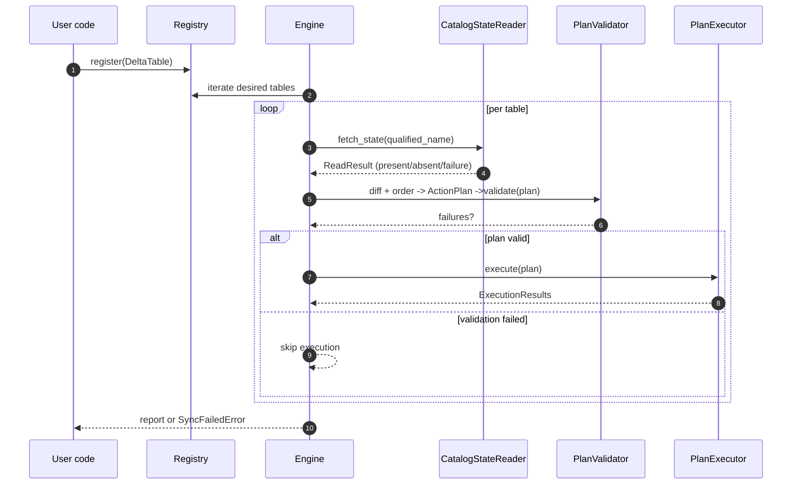

# Architecture Overview

This page shows the high-level design. It focuses on the main components, their roles, and the sync flow.

## Component/Class Diagram

Notes:
- The engine is backend-agnostic via small ports (`CatalogStateReader`, `PlanExecutor`).
- Plans are deterministic (create → adds → drops; subjects alphabetical).
- Validation runs before execution to catch obvious mistakes early.
