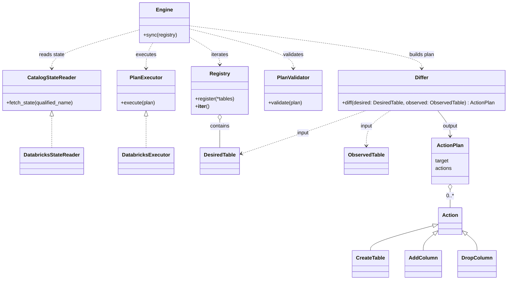
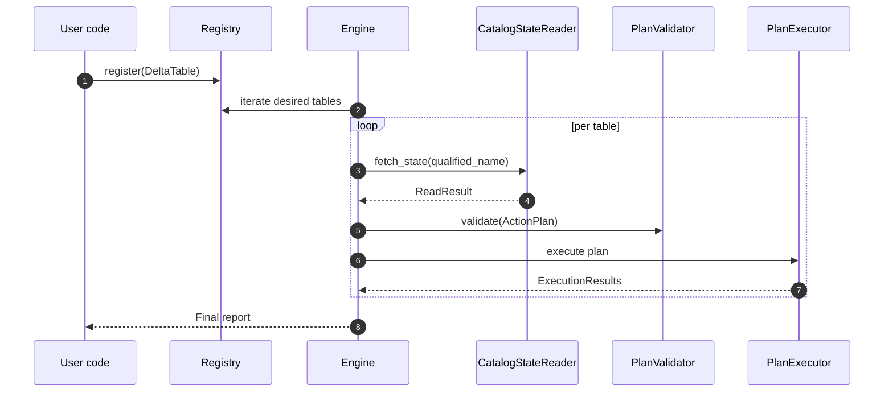
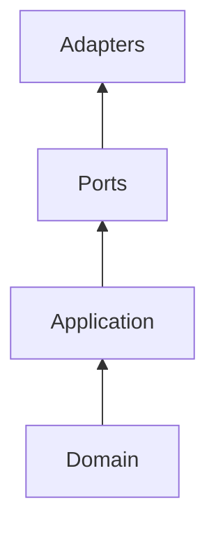

# Architecture Overview

This page shows the high-level design. It focuses on the main components, their roles, and the sync flow.

## Component/Class Diagram

Notes:
- Plans are deterministic (create → adds → drops; subjects alphabetical).
- Validation runs before execution to catch obvious mistakes early.
- Hexagonal architecture: dependencies point inward from Adapters → Ports → Application → Domain.  
  - The Domain layer is pure and independent
  - Application orchestrates use cases without knowing about backends.
  - Small ports (e.g. `CatalogStateReader`, `PlanExecutor`) keep the engine backend-agnostic.  

