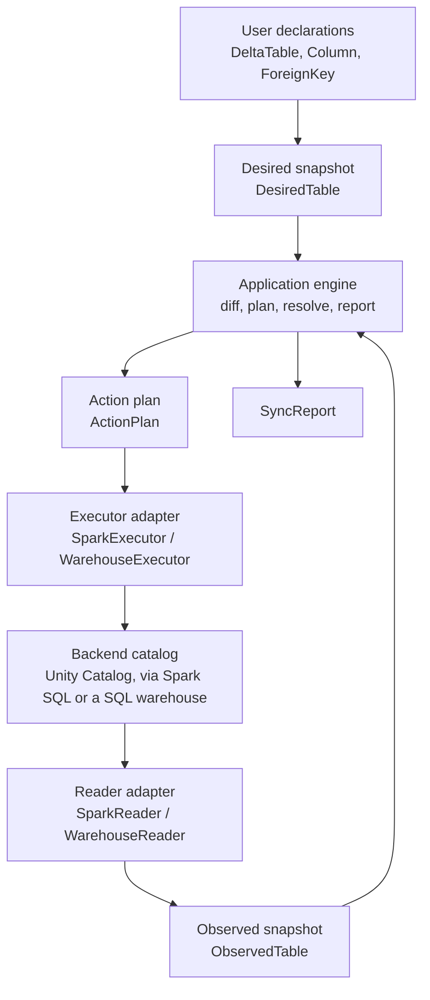
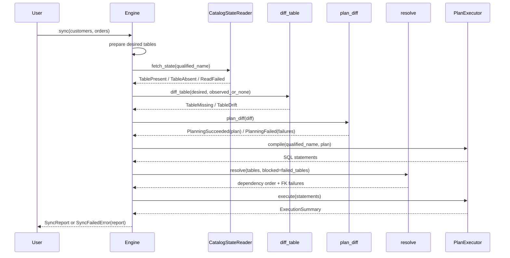
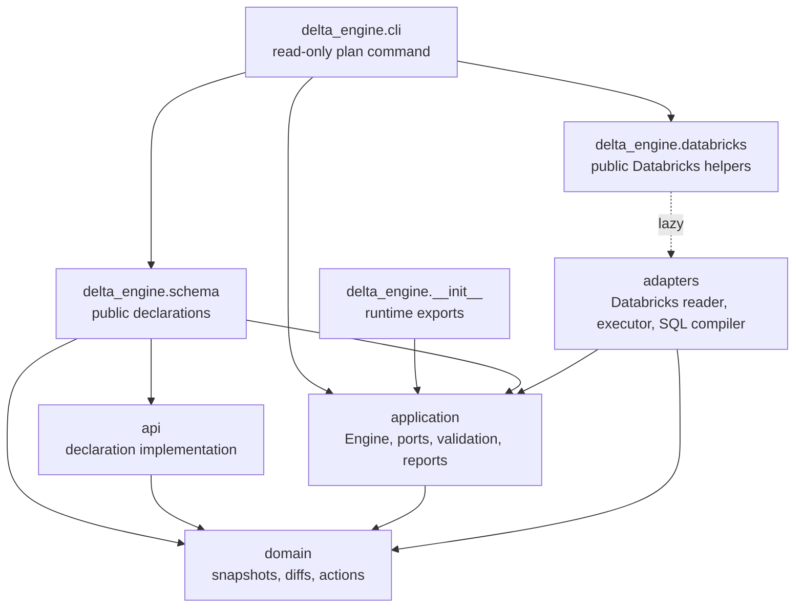
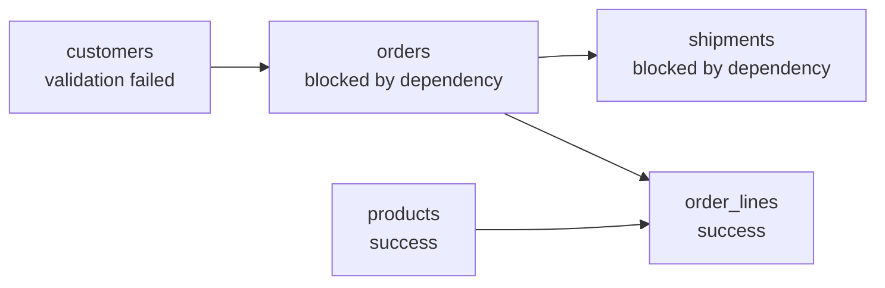

---
tags:
  - explanation
---

# Architecture

delta-engine is a small planning core wrapped in a hexagonal, or ports and
adapters, architecture. User code declares the state a table should have. An
adapter reads the state the catalog currently has. The engine compares those two
snapshots, validates the differences, turns the allowed differences into a
deterministic action plan, resolves foreign-key dependencies across tables, and
then asks an adapter to execute the plan.

The important separation is this:

- The **domain** knows how to represent tables, diffs, and schema-change actions.
- The **application** knows how to run a sync, apply safety policy, resolve
  dependencies, and report failures.
- The **adapters** know how a backend such as Databricks exposes catalog state
  and accepts DDL.
- The **public API** gives users a convenient way to describe desired tables
  without exposing the internal planning model directly.

That split keeps the planning code free of backend _imports_. It does not yet
make it free of backend _knowledge_: Delta and Databricks semantics are still
encoded in the application layer, so Databricks is the first adapter but, today,
also the only one the rest of the engine is written for. See
[Import purity versus semantic coupling](#import-purity-versus-semantic-coupling)
for what that means for adding a new backend.



## Core concepts

The architecture is easiest to follow if you start with the data that moves
through a sync.

| Concept            | Role                                                                                                                                                    |
| ------------------ | ------------------------------------------------------------------------------------------------------------------------------------------------------- |
| `DeltaTable`       | Public user declaration. It is the object users write in notebooks, scripts, and Python modules.                                                        |
| `DesiredTable`     | Immutable domain snapshot of the target table state. `DeltaTable.to_desired_table()` lowers the public declaration into this shape.                     |
| `ObservedTable`    | Immutable domain snapshot of the current catalog state. Reader adapters produce this after normalizing backend details.                                 |
| `CatalogState`     | The result of reading one table: `TablePresent`, `TableAbsent`, or `ReadFailed`.                                                                        |
| `TableDiff`        | Typed desired/observed drift. It is either `TableMissing` or `TableDrift`; both state their remedies as `actions`, and a drift also carries `findings`. |
| `Finding`          | A `TableDrift` difference no action can close: `ColumnRenameConflict`, `PropertyUndeclared`, or `PartitioningChanged`.                                  |
| `TableAspect`      | One managed aspect of a table: existence, columns, comments, properties, tags, partitioning, clustering, primary key, or foreign keys. Internal enum.   |
| `ValidationResult` | Lower-level validation verdict used to test policy rules in isolation.                                                                                  |
| `PlanningResult`   | The total application boundary: either `PlanningSucceeded(ActionPlan)` or `PlanningFailed(validation failures)`.                                        |
| `ActionPlan`       | The ordered, table-local actions that should be executed if the table is allowed to run.                                                                |
| `ResolveResult`    | The foreign-key dependency order plus any FK-specific failures.                                                                                         |
| `ExecutionSummary` | The result of running a plan's compiled statements. It records successful statements and the first failed statement, if execution failed.               |
| `TableRunReport`   | The complete per-table outcome, including read state, plan, planned SQL statements, failures, and execution.                                            |
| `SyncReport`       | The aggregate result for the whole sync. It is returned on success and attached to `SyncFailedError` on real-run failure.                               |

The table snapshots deliberately use domain vocabulary, not Spark vocabulary.
For example, the domain has `DesiredColumn`, `QualifiedName`, `PrimaryKeyConstraint`,
`ForeignKeyConstraint`, and `DataType` values. The Databricks adapter is
responsible for translating Spark catalog objects and SQL type names into those
values before the engine sees them.

## The hexagonal boundary

The application owns the ports. Adapters implement them. The engine does not
call Spark, query `information_schema`, or compile SQL directly; it talks to the
two protocols in `delta_engine.application.ports`.


`CatalogStateReader.fetch_state(qualified_name)` returns one of:

- `TablePresent(table=ObservedTable(...))`
- `TableAbsent()`
- `ReadFailed(failure=ReadFailure(...))`

`PlanExecutor` is a two-stage boundary. `compile(qualified_name, plan)` lowers
a plan to the backend statements that apply it — the engine calls it in the
plan phase on every run, dry or real, and records the statements on the
table's report. `execute(statements)` then runs that same tuple and returns an
`ExecutionSummary` with one result per attempted statement, so the previewed
SQL is exactly what executes.

`fetch_state` and `execute` are **total**. Adapter implementations catch
backend exceptions and return typed failures instead of raising
backend-specific exceptions through the port. This is not just a convenience
for callers. It is what lets one unreadable or unmodifiable table fail while
the engine keeps processing the rest of the run and returns a complete report.
`compile` is the exception: it is pure and local, cannot fail against a
backend, and an exception from it is a programming error that propagates.

The Databricks adapters also own backend normalization, most of it shared
between the two backends through the `sql` core: lowercasing catalog
identifiers, reading Unity Catalog constraints and tags through the same
information_schema queries and row mappers, and quoting SQL identifiers.
DDL type-string parsing is shared too — `sql/parse.py` turns catalog type
text into domain data types for both backends, since Unity Catalog reports
column types as DDL strings on the Spark path (`listColumns`) and the
warehouse path (`information_schema.columns`) alike. The per-column read
policy is equally shared: an unmappable type skips the column with a
warning, unless it is a partition column, which fails the read.
Exception translation is where the backends
genuinely diverge: the Spark backend unwraps `Py4JJavaError` to report the
underlying JVM exception class, while the warehouse backend has no such
wrapper to unwrap and calls the shared, generic summarizer directly. Both
paths turn backend exceptions into `ReadFailure` or `ExecutionFailure`
values.

### Type-model fidelity

The differ compares a declared table with an observed one, so every fact the
domain type model carries must survive the round trip
declaration → catalog → observation exactly. A fact that only one side can
carry is worse than an unmodeled one. Declarable but not observable: every
sync reports drift that is not there, and when the false drift is a blocked
change (a partitioning change, say) the table fails validation forever.
Observable but not declarable: the catalog permanently disagrees with the only
spelling a declaration can use. Facts that cannot round-trip are therefore
normalized out on both sides rather than modeled halfway.

`CHAR(n)` and `VARCHAR(n)` are the worked example. Delta stores both as
`STRING` and enforces the length bound as a write-time check, and Databricks
recommends `STRING` for new tables. Mapping them to their own domain types on
the read side only would make every observed varchar column drift against the
only declarable spelling (`String`) and fail validation permanently; modeling
them fully would mean owning length-transition safety rules for a type the
platform steers users away from. The reader instead observes both as `String`:
no drift, no `CHAR`/`VARCHAR` DDL is ever emitted, and the catalog keeps
enforcing the length. The trade-off is deliberate: a declaration cannot create
a varchar column, and an out-of-band length change is invisible to drift
detection.

`Struct` shows the same rule inside a modeled type. Struct fields carry name
and type only: the catalog reports column types as DDL text, which does not
reliably round-trip nested field nullability or comments, so declaring either
would produce a permanent, blocked `AlterColumnType` action against whatever
the reader observes. Both sides normalize to name + type instead — declared
fields are created nullable, nested comments are unmanaged, and modeling
field nullability waits until the reader observes a real `StructType` rather
than DDL text.

The model is also a pinned vocabulary while the catalog's keeps growing:
`TIMESTAMP_NTZ` and `VARIANT` both went from nonexistent to real column
types within the life of running tools, and the next addition will reach
tables before it reaches engines that pin a type model. An observed type
outside the model is therefore a routine lifecycle condition, not a defect,
and the reader handles it by how much the omission would distort the
snapshot: an ordinary unmappable column is skipped and left unmanaged (the
snapshot stays honest about everything else), but an unmappable partition
column fails the whole read — an incomplete `partitioned_by` would fabricate
partitioning drift, and a false blocked change is worse than an honest
`READ_FAILED`.

### Import purity versus semantic coupling

The layering is enforced by import-linter: `domain` and `application` cannot
import `pyspark` or `delta`, and a new adapter adds no backend imports to them.
That is the _hard_ form of the hexagonal boundary, and it holds.

The _soft_ form — that the domain and application layers know nothing about any
particular backend — does not fully hold today. Delta and Databricks semantics
are encoded as ordinary Python in the application layer:

- `application/properties.py` is a registry of Delta table properties
  (`delta.columnMapping.mode`, `delta.enableChangeDataFeed`, retention
  durations, …), with Delta-specific value formats and transition rules.
- Several rules in `application/validation.py` encode Delta behaviour directly.
  `ColumnMappingRequiredForDrop` exists only because Delta permits
  `DROP COLUMN` solely under `delta.columnMapping.mode='name'`;
  `PropertyTransitionNotSupported` and `PropertyMustBeDeclared` operate on that
  Delta property registry.

import-linter cannot catch this, because it is backend _knowledge_ expressed in
ordinary types, not a forbidden import.

The practical consequence is about what a new backend costs. A backend that
shares Delta's semantics — another Delta-on-Spark or Unity Catalog surface — can
be added by implementing the two ports alone. A genuinely different table
format, such as Iceberg, would first need this Delta-specific policy lifted out
of the application layer (or made selectable per backend) so its own property
model and safety rules could take its place. Until then, delta-engine is a
Delta/Databricks engine with a clean adapter seam, not a format-neutral one.

## Sync lifecycle

`Engine.sync(...)` is a phase chain. Before the chain begins, user-facing table
sources are prepared: each source is lowered with `to_desired_table()`, duplicate
qualified names are rejected, and the desired tables are sorted by qualified
name so reports and sync behavior do not depend on the order arguments were
passed.

After preparation, the engine runs six internal phases over private `_TableRun`
objects. A `_TableRun` is a mutable scratch pad for one table. It accumulates
read state, diff, plan, failures, and execution results before it is frozen into
an immutable `TableRunReport`.



The full run, with preparation first and reporting last bracketing the five
phases:

1. **Prepare** (before the chain): lower user-facing table declarations to
   `DesiredTable` values and reject duplicate qualified names.
2. **Read**: ask the reader port for the current catalog state of each table.
3. **Diff**: compute the typed `TableDiff` with `diff_table`.
4. **Plan**: call the total `plan_diff` boundary, which always applies the
   default validation policy. A rejected result contributes validation
   failures and has no plan; an accepted result carries the privately
   constructed `ActionPlan`, which the engine compiles through the executor
   port for dry-run preview and execution.
5. **Resolve**: order tables by foreign-key dependency and block dependents of
   failed tables.
6. **Execute**: run the compiled statements of every table that has a
   non-empty plan and no failures.
7. **Report** (after the chain): return `SyncReport`, or raise
   `SyncFailedError` with the report on real runs that failed.

Execution is gated by accumulated failures. A table that failed read,
validation, or foreign-key resolution keeps its failure in the report and is
skipped during execution. The engine still processes other tables.

| Shape              | Produced by            | Consumed by                      | Purpose                                |
| ------------------ | ---------------------- | -------------------------------- | -------------------------------------- |
| `DeltaTable`       | User code              | Application preparation          | Public declaration object              |
| `DesiredTable`     | API lowering           | Domain planner, resolver, report | Target schema snapshot                 |
| `ObservedTable`    | Reader adapter         | Domain planner, report           | Catalog schema snapshot                |
| `TableDiff`        | `diff_table`           | `plan_diff`                      | Direct actions and findings            |
| `ActionPlan`       | successful `plan_diff` | Executor (`compile`), report     | Ordered, validated table-local actions |
| `CatalogState`     | Reader port            | Engine                           | Present, absent, or read-failed state  |
| SQL statements     | Executor (`compile`)   | Executor (`execute`), report     | The DDL a plan lowers to               |
| `ExecutionSummary` | Executor port          | Engine, report                   | Attempted statement outcomes           |
| `SyncReport`       | Engine                 | User code                        | Immutable run result                   |

## Package map

| Package                    | Responsibility                                                                                      | Examples                                                                             |
| -------------------------- | --------------------------------------------------------------------------------------------------- | ------------------------------------------------------------------------------------ |
| `delta_engine.cli`         | Read-only command composition and rendering                                                         | `plan`, declaration loading, unified-auth SQL connection                             |
| `delta_engine.schema`      | User-facing declaration import surface                                                              | `DeltaTable`, `ForeignKey`, `Property`                                               |
| `delta_engine.api`         | Declaration implementation package                                                                  | `DeltaTable`, `ForeignKey`, `Property`                                               |
| `delta_engine.application` | Use-case orchestration, accepted/rejected planning, ports, failures, dependency resolution, reports | `Engine`, `plan_diff`, `CatalogStateReader`, `PlanExecutor`, `resolve`, `SyncReport` |
| `delta_engine.domain`      | Backend-free snapshots, diffs, actions, and deterministic planning                                  | `DesiredTable`, `ObservedTable`, `TableDiff`, `ActionPlan`                           |
| `delta_engine.adapters`    | Backend integration and translation                                                                 | `SparkReader`, `SparkExecutor`, `WarehouseReader`, `WarehouseExecutor`, SQL compiler |



The arrows show source dependencies. The domain does not import Spark,
Databricks, the application layer, or adapter code. Backend-specific code
depends inward on the application ports and domain vocabulary. The top-level
`delta_engine` package eagerly exposes backend-neutral runtime types such as
`Engine`, `SyncReport`, and `SyncFailedError`, so `import delta_engine` does not
require PySpark.

`delta_engine.cli` sits above the hexagon as a driving adapter: a thin Typer
layer (the `cli` extra) that loads one explicit declaration collection, opens
one warehouse connection through Databricks unified authentication, and calls
`Engine.sync(..., dry_run=True)`. Its connection module validates warehouse
selection, delegates workspace and credential resolution to the SDK, derives
the connector HTTP path, and owns the connection lifecycle. Authentication
policy stays in the invoking environment. Catalog reads and SQL compilation
remain in the warehouse adapter. Exact planned-SQL text rendering is
CLI-private; the application layer exposes the report data, diff renderer, and
report renderer without taking on command-specific presentation policy. The
CLI contains no apply orchestration or planning and validation policy of its
own.

`delta_engine.schema` and `delta_engine.databricks` are the public import paths
for users. Their implementations still live in `delta_engine.api` and
`delta_engine.adapters.databricks`, respectively.

Inside `delta_engine.adapters.databricks`, the code is split by what it needs
at import time. The `sql` subpackage is the shared SQL-text core — DDL
compilation, identifier quoting, and `information_schema` queries — and is
PySpark-free, enforced by an import-linter contract. Two backends build on
that core today: the `spark` subpackage syncs through an active Spark
session (the reader and the executor), and the
`warehouse` subpackage syncs through a Databricks SQL warehouse connection
over `databricks-sql-connector`, with no PySpark import anywhere in it. Both
compile to identical SQL through the shared compiler, so a dry-run preview
does not depend on which one ran it, and both read mostly the same shared
`information_schema` and `DESCRIBE DETAIL` queries — differing in the
transport those queries run over: in-process Spark SQL versus the warehouse
connection's cursor. The read-side split is narrow: the Spark backend takes
table existence, column listing, and the table comment from Spark catalog
calls instead of `information_schema`, which is why only the Spark backend
can read catalogs without one, such as `hive_metastore`.

## Diff-first planning

Planning is two pure stages connected by a typed diff. `diff_table(desired,
observed)` produces a `TableDiff` — `TableMissing` when the table does not
exist, else a `TableDrift` holding executable `actions` and non-action
`findings` as two typed tuples. Actions carry their `TableAspect` plus the
complete desired/observed state needed by validation and reporting;
`CreateTable` uses the table-existence aspect because it realizes a missing
table's complete desired state rather than belonging to one schema dimension.
Every value is named once (`desired_*` / `observed_*` for transition state),
and compilers and renderers read those names directly. There is no mirrored
fact vocabulary and no lowering method.

Naming differences by their remedies (`SetTableComment` rather than a
separate "comment changed" fact) rests on one assumption: remedies are
one-to-one. For every remedied difference this engine has exactly one
operation that closes it, which is what lets a single vocabulary serve
diffing, validation, reporting, and compilation. If an aspect ever admits
alternative remedies — say, a type change resolvable by an in-place widen
or by an add-and-backfill — the difference and its remedy stop being the
same thing, and the vocabularies must separate again for that aspect.

Both arms state the complete intended transition the same way: a
`TableMissing` exposes its creation actions — CREATE TABLE plus tag and
foreign-key follow-ups — so accepted planning is uniformly "construct an
`ActionPlan` from the diff's actions" for creation and drift alike.

An accepted plan is the diff's actions verbatim; nothing sits between
validation and plan construction. Constraint replacement around a column
rename is stated explicitly and sequenced by `ActionPlan` phase ordering:
PK/FK drops run before the rename, while each constraint still exists under
its observed name, and declared keys are re-added afterwards. Databricks
would drop those constraints implicitly as part of `RENAME COLUMN`; the
engine states the drops instead of relying on that, so the plan is a
complete transcript of what executes.

Only three findings exist: `ColumnRenameConflict`, `PropertyUndeclared`, and
`PartitioningChanged`. Each states an ambiguity or unsupported transition
without deciding its policy outcome. The `Finding` union names them, they
live structurally apart from the actions, and the application default rules
decide to reject each one.

Whether a difference is permitted is application policy. `plan_diff` always runs
the default policy and returns either `PlanningSucceeded(plan)` or
`PlanningFailed(failures)`. Only the success arm has an `ActionPlan`, and plan
construction is private to that boundary, so callers cannot plan raw diffs
without validation. `validate_diff(..., rules=...)` remains the lower-level
interface for testing alternative rule sets; it does not construct plans.

Two aspects deliberately diff under different semantics. Properties are
exact-declaration: the declaration is the complete list of managed keys — a
declared value is reconciled, a declared `None` asserts absence (unset
when present), a managed key observed without a declaration is a blocking
change, and unmanaged keys (platform-written) are invisible. The reader
adapter filters unmanaged keys out of the observed state before the domain
sees them, and the properties diff runs only when the declaration manages
`PROPERTIES`. Tags are full-state (an observed-only tag is drift and is
unset).

## Managed aspects

Every `DesiredTable` carries a `managed_aspects` field: a `frozenset[TableAspect]`
naming the aspects the engine reconciles for that table. The differ
(`diff_table`) is scope-blind for every aspect except properties — the
properties diff runs only when the declaration manages `PROPERTIES` (see
Diff-first planning). The `TableDrift` it produces carries the `desired`
table itself (symmetric with `TableMissing`), so the diff is self-contained
and `validate_diff` takes only the diff. Scope awareness lives in
validation, as an unconditional invariant rather than an optional rule:
`validate_diff` fails the sync once per unmanaged aspect that has drifted
(`UnmanagedAspectDrift`), and rules read `drift.managed_actions` and
`drift.managed_findings` — so unmanaged drift produces exactly one scope
failure rather than also tripping safety rules for differences the user never
requested. If planning succeeds, every difference belongs to a managed aspect
and the plan holds executable actions only.

The public API exposes named scopes only: `DeltaTable`'s `scope` parameter
maps `"metadata"` to the metadata aspects (comments, tags, key constraints)
and `"tags"` to table and column tags only. The `TableAspect` enum stays
internal.

`CLUSTERING` is not one of the metadata aspects: liquid clustering keys
change how data files are laid out on storage, so a `metadata_only` sync
never reconciles them, the same as `COLUMN_STRUCTURE` and `PARTITIONING`.

`diff_table(desired, observed)` produces a `TableDiff`:

- `TableMissing` means the catalog has no table at that name.
- `TableDrift` means the table exists and carries its actions and findings.

The diff produces backend-neutral commands but does not decide whether they are
safe, and it does not talk to the backend. For an existing table, differences span
these aspects:

- columns
- table comment
- table properties
- table tags
- partitioning
- clustering
- primary key
- foreign keys

Each dimension produces canonical actions directly. For example, column
additions produce `AddColumn` plus any `SetColumnTag` actions, table tag
removals produce `UnsetTableTag`, and foreign-key additions produce
`SetForeignKey`. Unsupported or ambiguous states use one of the three
finding types, which the current default policy rejects.

`validate_diff` is where policy lives. A missing table passes when the
declaration manages table existence because creating it from the full
declaration is safe. A drift is evaluated by the rules in `DEFAULT_RULES`,
which currently reject:

- adding a non-nullable column to an existing table
- tightening an existing column to `NOT NULL`
- changing an existing column's data type outside the Delta widening matrix,
  or widening it without `delta.enableTypeWidening='true'` declared
- changing table partitioning in place

The engine calls `plan_diff` once. A `PlanningFailed` keeps the run's plan empty
and records its validation failures; a `PlanningSucceeded` supplies the only
plan the compiler can receive.

## Deterministic action plans

An `ActionPlan` owns action ordering. Callers do not sort actions manually.

Every action declares two ordering fields:

- `phase`: an `ActionPhase` value (an `IntEnum`) that encodes dependency order
  between kinds of DDL.
- `subject`: the table-local name targeted by that action, such as a column,
  property, tag, or constraint name.

`ActionPlan` sorts actions by phase and then lexicographically by subject. This
makes plans stable even when declarations or dictionaries arrive in different
orders.

The phase ordering exists because backend DDL has dependencies:

- Table creation comes before follow-up tag and foreign-key actions for a
  missing table.
- Foreign keys are dropped before primary keys and column drops, because a
  referenced key or column cannot be dropped while an FK still points at it.
- Primary keys are dropped before column mutations, so no key references a
  column being dropped or altered.
- Column nullability changes run before primary keys are set, because primary
  key columns must be non-nullable.
- Foreign keys are set last, after the referenced primary key exists.
- Clustering keys are altered after columns are added (a new clustering key may
  name a column this same sync is still adding) but before columns are dropped,
  so a table is reclustered off a column before that column is removed — a sync
  that both drops the live clustering-key column and reclusters elsewhere must
  not drop it while it is still the active key.
- Column types are widened after properties are set, so a declaration enabling
  `delta.enableTypeWidening` in the same sync takes effect before the widen —
  and between the primary-key drop and set, so a key whose column widens is
  dropped before and re-added after.

The domain plan describes intent. The adapter compiler decides how each action
is rendered for its backend.

## Foreign-key dependencies

Foreign keys affect both table-local SQL order and cross-table sync order.

Within a table, FK actions are ordered by `ActionPhase`: drops happen early and
sets happen late. Across tables, the application resolver orders referenced
tables before dependents so a dependent table does not try to add a foreign key
before a target that is already known to be unable to run.



The resolver builds a graph from desired foreign keys and uses strongly
connected components to produce a dependency-first order. It reports:

- `UNRESOLVABLE_REFERENCE` when a foreign key points to a table that is not part
  of the sync.
- `REFERENCED_COLUMNS_NOT_A_KEY` when the referenced columns are not exactly the
  referenced table's primary key.
- `CYCLE` for true multi-table FK cycles.
- `BLOCKED_BY_FAILED_DEPENDENCY` when a table depends on another table that
  is already known to have failed before execution begins, such as a table with
  a read failure, validation failure, unresolvable FK, invalid FK target, or FK
  cycle.

Each rule implements the `Rule` protocol: a `name` `ClassVar[str]` and an `evaluate(drift: TableDrift) -> tuple[ValidationFailure, ...]` method. Rules usually scan `drift.managed_actions` or `drift.managed_findings` directly — typically matching a specific type with `isinstance` — and return all violations at once, avoiding a fix-and-rerun cycle per failure.

`validate_diff` dispatches on the diff variant first: a `TableMissing` passes automatically when table existence is managed — creating a table from its full declaration is always safe — and fails with `MissingTableUnmanaged` when it is not, so no rule ever sees a missing table. For a `TableDrift`, `validate_diff` calls every rule in `DEFAULT_RULES` with the drift and aggregates their failures into a `ValidationResult`. `plan_diff` fixes that default policy in place and turns the verdict into the accepted/rejected planning sum.

Execution happens after resolution, and there is no second dependency pass after
an execution failure. A dependency's execution failure is recorded on that
dependency's report, but it is not retroactively converted into
`BLOCKED_BY_FAILED_DEPENDENCY` failures on later tables in the same run.

## Public declarations and lowering

`DeltaTable` is the public declaration object, but the engine plans with
`DesiredTable`. The lowering boundary does several important things up front:

- rejects property keys the engine does not manage (valued or `None`) and
  rejects invalid declared property values
- generates a primary-key constraint from the table-level `primary_key` argument
- lowers public `ForeignKey` declarations into domain `ForeignKeyConstraint`
  values
- validates structural invariants such as non-empty columns, unique column
  names, valid partition columns, valid FK local columns, and non-nullable
  primary-key columns

A `ForeignKey` declares its target by passing the referenced `DeltaTable` object
directly, or the `Self` sentinel for a self-reference:

```python
customers = DeltaTable(
    catalog="dev",
    schema="silver",
    name="customers",
    columns=[...],
    primary_key=["id"],
)

orders = DeltaTable(
    catalog="dev",
    schema="silver",
    name="orders",
    columns=[...],
    foreign_keys=[
        ForeignKey(columns={"customer_id": "id"}, references=customers),
    ],
)
```

This object reference lets the API validate the mapping against the
referenced table's actual primary key, and keeps the reference valid if the
target is renamed. The tradeoff is that the referenced table must be declared
in Python scope. Within one module that usually means defining the parent
before the child; across modules it means importing the referenced table.

This source-code order does not determine execution order. The engine sorts
prepared desired tables by qualified name for deterministic setup, then the
resolver topologically orders them by FK dependency before execution.

References by dotted name are intentionally not supported in this iteration. If
that becomes necessary, the API can be widened to accept a `QualifiedName` as an
additional branch. That would be backward-compatible: the referenced columns are
already explicit in the `columns` mapping, so a bare name would only lose the
primary-key object the engine validates the mapping against.

Partitioning is shaped by a related decision. `primary_key` and
`partitioned_by` are both table-level lists of column names, but "order"
means something different for each. A primary key's declaration order only
controls how the constraint is rendered — identity and drift compare it as a
set, so `(a, b)` and `(b, a)` are the same key. Partition order is
significant instead: the order of names in `partitioned_by` sets the physical
directory nesting Delta writes, and that nesting can be different from the
order columns appear in the table. The differ compares that list positionally,
which is why reordering it is drift, not a no-op.

Clustering is the other physical layout, and it is declared the same way —
`clustered_by` is a table-level list on `DeltaTable`, the sibling of
`partitioned_by` (the two are mutually exclusive; a table has one layout
strategy). What differs is not the declaration shape but the _comparison_:
liquid clustering has no physical directory nesting, so key order carries no
meaning — Delta clusters by the key _set_. So the differ compares
`partitioned_by` positionally (reordering it is drift) but compares
`clustered_by` as a set (reordering the keys is a no-op). The general rule: a
physical layout is a table-level list (`partitioned_by`, `clustered_by`), and
whether order is significant is a property of the differ, not of the
declaration shape.

## Constraint names

Constraint names are data, not hidden compiler policy.

For desired tables, the API layer generates names when a `DeltaTable` is lowered
to a `DesiredTable`:

- primary key: `{table}_pk`
- foreign key: `{table}_{local_columns}_fk`, joining the local columns in
  sorted order, so the name is independent of declaration order

For observed tables, the reader adapter reads constraint names from the catalog.
After that, names live on `PrimaryKeyConstraint` and `ForeignKeyConstraint`
objects. The differ and SQL compiler read the names directly instead of
deriving them again.

The diff uses constraint content, not names alone, to decide identity:

- primary-key identity is the set of key columns; declaration order and
  constraint name do not make two primary keys different.
- foreign-key identity is the signature of local columns, referenced table, and
  referenced columns; an unchanged FK with a different catalog constraint name
  stays idempotent.

This keeps naming policy at the boundary where the domain model is populated and
keeps downstream planning focused on schema facts.

## Reporting and failure semantics

Failures are phase-tagged application values. A `TableRunReport` derives its
status from the earliest failing phase:

- `READ_FAILED`
- `VALIDATION_FAILED`
- `FOREIGN_KEY_FAILED`
- `EXECUTION_FAILED`
- `SUCCESS`

The report keeps the full failure tuple, not just the status. That matters when
a table has multiple validation failures or multiple FK failures. For execution,
the Databricks executor stops at the first failed statement because the engine
is not transactional and later statements may depend on earlier ones. The
`ExecutionSummary` records all attempted statements up to that point.

Reports also keep the plan even when execution does not happen. That makes dry
runs useful and makes failed runs explainable: a user can inspect what would
have happened, which phase blocked it, and which downstream tables were blocked
as a result.

## Lazy PySpark imports

The top-level `delta_engine` package is designed to be importable without
PySpark installed. It eagerly exports backend-neutral runtime objects,
including `Engine`, `SyncReport`, and `SyncFailedError`. Schema declarations
live in `delta_engine.schema`, which is also PySpark-free.

Databricks helpers live in the adapter package. Importing
`delta_engine.databricks` itself imports neither PySpark nor
`databricks-sql-connector`; each of its public functions lazy-imports only
the backend it needs when called:

- `build_spark_engine` imports `delta_engine.adapters.databricks.spark` on
  demand, which requires PySpark.
- `build_sql_engine` imports `delta_engine.adapters.databricks.warehouse` on
  demand. That backend runs without PySpark entirely, and does not import
  `databricks-sql-connector` either — it only takes a connection the caller
  already opened.
- `configure_logging` imports the shared `log_config` module, which needs
  neither.

Plain table declarations and schema-only tests do not pay any backend's
dependency cost.

## Where to make changes

| Change                          | Main location                                                              | Notes                                                                                                                                                                                                       |
| ------------------------------- | -------------------------------------------------------------------------- | ----------------------------------------------------------------------------------------------------------------------------------------------------------------------------------------------------------- |
| Add a new backend               | `delta_engine.adapters`                                                    | Implement `CatalogStateReader` and `PlanExecutor`; keep backend exceptions inside the adapter.                                                                                                              |
| Add a new executable difference | `delta_engine.domain.plan.actions`, differ, and adapter compiler           | Define the rich action, its aspect and phase in `actions.py`; emit it directly from the relevant `_diff_*` helper; add policy rules if needed; compile it in the backend adapter.                           |
| Add a new finding               | `delta_engine.domain.plan.diff` and application validation                 | Add the frozen domain difference to `Finding`, emit it into the diff's findings, then make the rejection or acceptance decision in application policy. Successful planning must still contain actions only. |
| Add a safety rule               | `delta_engine.application.validation`                                      | Rules inspect the drift's managed actions and findings and return `ValidationFailure` values.                                                                                                               |
| Add a data type                 | `delta_engine.domain.model.data_type` and adapter type mapping             | The domain type is backend-free; SQL names and Spark parsing live in the Databricks adapter.                                                                                                                |
| Change public declarations      | `delta_engine.api`, surfaced only through `delta_engine.schema`            | Keep public ergonomics in `delta_engine.schema` and lower choices into domain snapshots before the engine phases begin.                                                                                     |
| Change FK ordering or blocking  | `delta_engine.application.dependency_resolution`                           | Cross-table dependency policy lives in the application layer, not in the domain plan or SQL compiler.                                                                                                       |
| Change report output            | `delta_engine.application.report` and `delta_engine.application.rendering` | Keep display formatting out of domain objects.                                                                                                                                                              |
| Change Databricks SQL           | `delta_engine.adapters.databricks.sql`                                     | Compile domain actions to backend statements at the adapter boundary.                                                                                                                                       |
| Change CLI commands or output   | `delta_engine.cli`                                                         | Thin orchestration over `declarations.py`, `connection.py`, and the application ports; keep policy in the layers below.                                                                                     |

## Architectural rules

- Keep PySpark and Databricks backend behaviour inside `delta_engine.adapters`.
  The CLI connection-composition module may import the Databricks SDK and SQL
  connector solely for authentication and connection lifecycle.
- Keep the domain backend-free, immutable, and deterministic.
- Make immutability real, not conventional: frozen dataclasses copy their
  collection fields in `__post_init__` — sequences into tuples, mappings into
  read-only views (`MappingProxyType`), aspect sets into `frozenset` — so an
  object cannot change after construction through a collection the caller
  still holds. This applies at the public boundary too: `ForeignKey.columns`
  and `Column.tags` copy what the user passed, so mutating the original
  mapping later does not alter the declaration.
- Put orchestration, safety policy, dependency resolution, and failure
  propagation in the application layer.
- Put backend normalization at adapter boundaries, such as lowercasing catalog
  identifiers, parsing Spark types, and quoting SQL.
- Return typed failures across ports instead of raising backend exceptions.
- Let `ActionPlan` own action ordering; callers should not sort plans manually.
- Keep user-facing schema convenience in `delta_engine.schema`, then lower to
  domain snapshots before planning begins.
