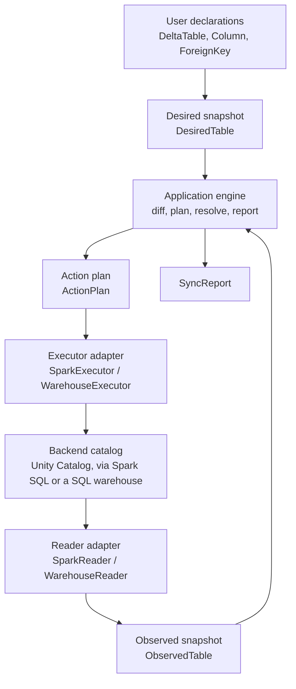
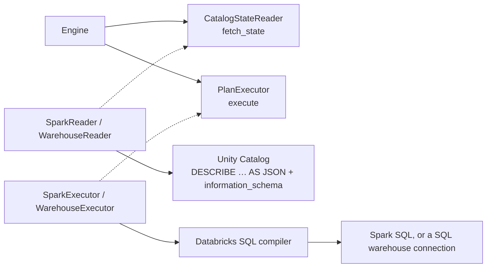
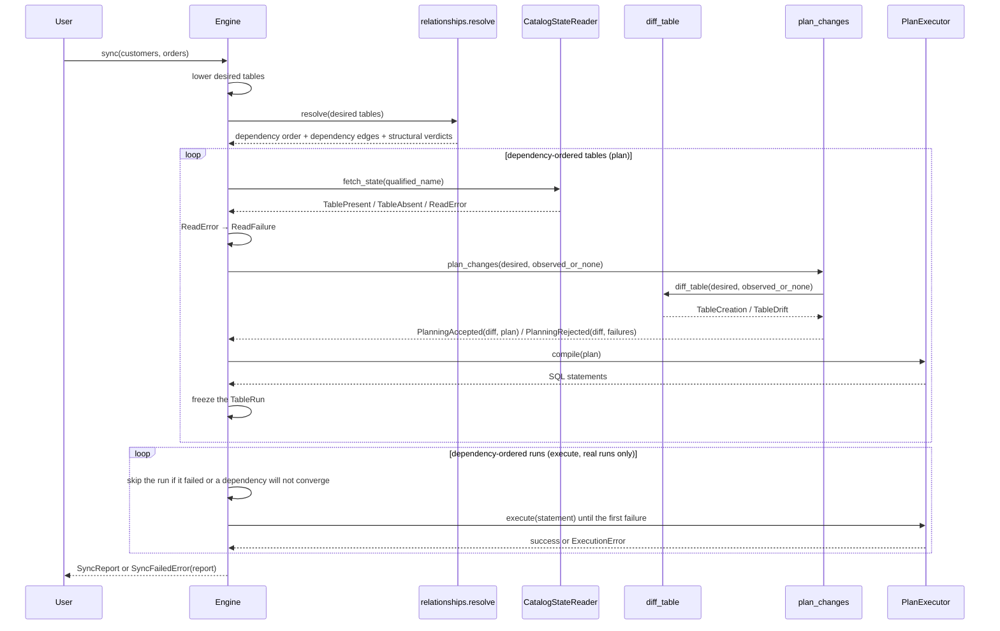
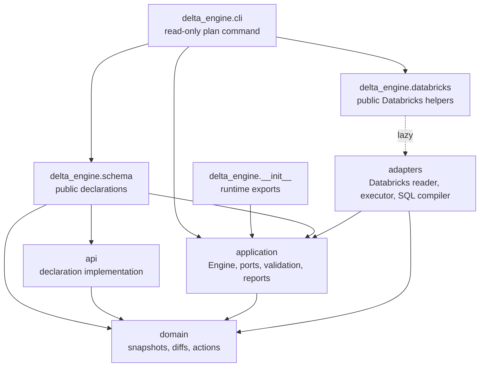
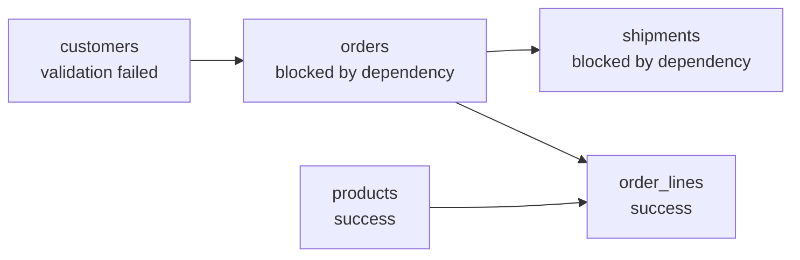

---
tags:
  - explanation
---

# Architecture

delta-engine is a small planning core wrapped in a hexagonal, or ports and
adapters, architecture. User code declares the state a table should have. An
adapter reads the state the catalog currently has. The engine compares those two
snapshots, validates the differences, turns the allowed differences into a
deterministic action plan, resolves foreign-key dependencies across tables, and
then asks an adapter to execute the plan.

The important separation is this:

- The **domain** knows how to represent tables, diffs, and schema-change actions.
- The **application** knows how to run a sync, apply safety policy, resolve
  dependencies, and report failures.
- The **adapters** know how a backend such as Databricks exposes catalog state
  and accepts DDL.
- The **public API** gives users a convenient way to describe desired tables
  without exposing the internal planning model directly.

That split keeps the planning code free of backend _imports_. It does not yet
make it free of backend _knowledge_: Delta and Databricks semantics are still
encoded in the application layer, so Databricks is the first adapter but, today,
also the only one the rest of the engine is written for. See
[Import purity versus semantic coupling](#import-purity-versus-semantic-coupling)
for what that means for adding a new backend.



## Core concepts

The architecture is easiest to follow if you start with the data that moves
through a sync.

| Concept            | Role                                                                                                                                                        |
| ------------------ | ----------------------------------------------------------------------------------------------------------------------------------------------------------- |
| `DeltaTable`       | Public user declaration. It is the object users write in notebooks, scripts, and Python modules.                                                            |
| `DesiredTable`     | Immutable domain snapshot of the target table state. `DeltaTable.to_desired_table()` lowers the public declaration into this shape.                         |
| `ObservedTable`    | Immutable domain snapshot of the current catalog state. Reader adapters produce this after normalizing backend details.                                     |
| `CatalogState`     | A known catalog answer: `TablePresent` or `TableAbsent`. An unreadable state crosses the port as `ReadError`.                                               |
| `ReadResult`       | The persistent read outcome retained by a table run: a `CatalogState` or the engine-created `ReadFailure`.                                                  |
| `TableDiff`        | Typed desired/observed drift. It is either `TableCreation` or `TableDrift`; both state their remedies as `actions`, and a drift also carries `unresolvable`. |
| `Unresolvable`     | A `TableDrift` difference no action can close: `ColumnRenameConflict`, `PropertyUndeclared`, or `PartitioningChanged`.                                      |
| `TableAspect`      | One managed aspect of a table: existence, columns, comments, properties, tags, partitioning, clustering, primary key, or foreign keys. Internal enum.       |
| `ValidationFailure` | One policy rejection: the rule that raised it and the message the user reads. `validate_diff` returns them in evaluation order, empty when the diff is valid. |
| `PlanningResult`   | The total planning outcome: either `PlanningAccepted(diff, plan)` or `PlanningRejected(diff, failures)`; both retain the diff they were planned from.        |
| `ActionPlan`       | The qualified table target, relation kind, and ordered actions that should be executed if the table is allowed to run.                                      |
| `TableResolution`  | One table's static relationship facts, in dependency-first order by tuple position: the declaration it was judged from, that table's dependency edges, and its structural foreign-key verdicts.                   |
| `ExecutionResult` | The result of running a plan's compiled statements. It records how many statements applied and the first failed statement, if execution failed.                   |
| `TableRun`   | The immutable public record of one table's run: desired state, read result, accepted plan, compiled SQL, failures, and execution result.                  |
| `SyncReport`       | The aggregate result for the whole sync. It is returned on success and attached to `SyncFailedError` on real-run failure.                                   |

The table snapshots deliberately use domain vocabulary, not Spark vocabulary.
For example, the domain has `DesiredColumn`, `QualifiedName`, `PrimaryKeyConstraint`,
`ForeignKeyConstraint`, and `DataType` values. The Databricks adapter is
responsible for translating Spark catalog objects and SQL type names into those
values before the engine sees them.

## The hexagonal boundary

The application owns the ports. Adapters implement them. The engine does not
call Spark, query `information_schema`, or compile SQL directly; it talks to the
two protocols in `delta_engine.application.ports`.



`CatalogStateReader.fetch_state(qualified_name)` returns one of:

- `TablePresent(table=ObservedTable(...))`
- `TableAbsent()`

If neither state can be determined, the adapter translates its backend
exception into the application-owned `ReadError` and raises it.

`PlanExecutor` is a two-stage boundary. `compile(plan)` lowers a plan to the
backend statements that apply it. The plan carries both its qualified table
target and the observed relation kind its actions lower against, so neither
identity nor SQL dialect travels as parallel context. The engine calls it in
the plan phase on every run, dry or real, recording the statements on the
table's report. On a real run, the engine passes that same tuple to
`execute(statement)` one statement at a time, so the previewed SQL is exactly
what executes.

For both outbound ports, adapters translate expected backend failures into
application-owned errors: `ReadError` or `ExecutionError`. The engine catches
only those specific exceptions and turns them into persistent `ReadFailure` or
`ExecutionFailure` values. A read failure blocks later phases for that table;
an execution failure stops that table's remaining statements. Independent
tables continue, while unexpected exceptions propagate. `compile` is pure and
local; an exception from it is likewise a programming error.

The Databricks adapters also own backend normalization, most of it shared
between the two backends through the `sql` core and the `read` assembly. Both
backends read a table with `DESCRIBE TABLE EXTENDED … AS JSON`, and a shared
parser turns that JSON document into a backend-neutral `TableDescription`:
lowercasing catalog identifiers, mapping the structured column types, and reading
the comment, partitioning, clustering, and table properties. During assembly,
the reader extracts the document's synthesized `delta.feature.* = supported`
properties into the observed table's typed feature set; those protocol keys
remain outside the user-managed property set.
`information_schema` supplies the constraint and tag metadata as structured rows
— Unity Catalog tags, the table's own primary and foreign keys, and inbound
foreign keys (the JSON document's embedded `table_constraints` string is left
unread) — which the shared read attaches during assembly. The whole read is one
entry point, `read.read_catalog_state`, and each backend supplies only how a
query runs. The read admits only the relations the engine manages — managed
or external Delta tables, judged from the relation kind and provider the
description carries — so a view, streaming table, foreign table, or non-Delta
format fails the read instead of being modelled as a table and planned
against. (Existing external tables are read and altered like managed ones;
creating one is not yet supported.) The read also decides which observed
property keys become engine state: only the keys the property policy
manages are kept, so the protocol internals every Delta table carries do not
read as drift. The
per-column read policy is shared and fails closed the same way: a column whose type
the domain cannot model fails the read rather than being dropped, because a
silently omitted column would read as "in sync" against a declaration that still
owns it. Statement execution and exception
translation are where the backends genuinely diverge: the Spark backend runs
`spark.sql(...)` and unwraps `Py4JJavaError` to report the underlying JVM
exception class, while the warehouse backend runs the same statements over a
`databricks-sql` cursor and calls the shared, generic summarizer directly. Both
paths turn backend exceptions into `ReadError` or `ExecutionError`; the engine
constructs the corresponding report failure values.

### Type-model fidelity

The differ compares a declared table with an observed one, so every fact the
domain type model carries must survive the round trip
declaration → catalog → observation exactly. A fact that only one side can
carry is worse than an unmodeled one. Declarable but not observable: every
sync reports drift that is not there, and when the false drift is a blocked
change (a partitioning change, say) the table fails validation forever.
Observable but not declarable: the catalog permanently disagrees with the only
spelling a declaration can use. Facts that cannot round-trip are therefore
normalized out on both sides rather than modeled halfway.

`CHAR(n)` and `VARCHAR(n)` are the worked example. Delta stores both as
`STRING` and enforces the length bound as a write-time check, and Databricks
recommends `STRING` for new tables. Mapping them to their own domain types on
the read side only would make every observed varchar column drift against the
only declarable spelling (`String`) and fail validation permanently; modeling
them fully would mean owning length-transition safety rules for a type the
platform steers users away from. The reader instead observes both as `String`:
no drift, no `CHAR`/`VARCHAR` DDL is ever emitted, and the catalog keeps
enforcing the length. The trade-off is deliberate: a declaration cannot create
a varchar column, and an out-of-band length change is invisible to drift
detection.

`Struct` applies the same rule inside a modeled type. Struct fields carry name,
type, and nullability: `DESCRIBE TABLE ... AS JSON` reports all three, and
`StructField(..., nullable=False)` renders the corresponding nested `NOT NULL`.
Nested comments remain unmanaged. A nullability-only difference within a struct
is visible as a change to the owning column's complete `Struct`
type. Like other struct changes, it is blocked rather than translated into a
special nested migration. Declarations also reject non-null fields below a
nullable parent or an array/map, because Databricks cannot deploy those states.

The model is also a pinned vocabulary while the catalog's keeps growing:
`TIMESTAMP_NTZ` and `VARIANT` both went from nonexistent to real column
types within the life of running tools, and the next addition will reach
tables before it reaches engines that pin a type model. An observed type
outside the model is therefore a routine lifecycle condition, not a defect,
and the reader handles it by how much the omission would distort the
snapshot: an ordinary unmappable column is skipped and left unmanaged (the
snapshot stays honest about everything else), but an unmappable partition
column fails the whole read — an incomplete `partitioned_by` would fabricate
partitioning drift, and a false blocked change is worse than an honest
`READ_FAILED`.

### Import purity versus semantic coupling

The layering is enforced by import-linter: `domain` and `application` cannot
import `pyspark` or `delta`, and a new adapter adds no backend imports to them.
That is the _hard_ form of the hexagonal boundary, and it holds.

The _soft_ form — that the domain and application layers know nothing about any
particular backend — does not fully hold today. Delta and Databricks semantics
are encoded as ordinary Python in the domain and application layers:

- `domain/plan/diff.py` contains the small Delta type-to-feature mapping
  (`TimestampNtz → timestampNtz`, `Variant → variantType`). Desired tables do
  not store this derived state. For an existing table, `diff_table` derives the
  required set from the desired column trees and subtracts the
  `supported_features` observed by the reader. Each missing member becomes an
  `EnableTableFeature` discrepancy. Missing tables skip this step because
  CREATE establishes the schema-implied features.
- `application/properties.py` defines the Delta table-property policy
  (`delta.columnMapping.mode`, `delta.enableChangeDataFeed`, retention
  durations, …), with Delta-specific value formats and transition rules.

  Feature requirements come in two kinds. A feature is _implied_ when the
  desired shape cannot exist without it — a `TIMESTAMP_NTZ` column always has
  `timestampNtz` — so nothing is declared, nothing is chosen, and the differ
  emits the upgrade itself. A feature is _operation-permitted_ when the table
  exists happily without it and one change needs it: `columnMapping` to drop
  or rename a column, `typeWidening` to widen in place. Those are the user's
  decision, reached through a managed property, so validation rejects the
  change until it is declared rather than enabling anything.
- Several rules in `application/validation.py` encode Delta behaviour directly.
  `ColumnMappingRequiredForDrop` exists only because Delta permits
  `DROP COLUMN` solely under `delta.columnMapping.mode='name'`;
  `PropertyTransitionNotSupported` and `PropertyMustBeDeclared` operate on that
  Delta property policy.

import-linter cannot catch this, because it is backend _knowledge_ expressed in
ordinary types, not a forbidden import.

The practical consequence is about what a new backend costs. A backend that
shares Delta's semantics — another Delta-on-Spark or Unity Catalog surface — can
be added by implementing the two ports alone. A genuinely different table
format, such as Iceberg, would first need this Delta-specific policy lifted out
of the application layer (or made selectable per backend) so its own property
model and safety rules could take its place. Until then, delta-engine is a
Delta/Databricks engine with a clean adapter seam, not a format-neutral one.

## Sync lifecycle

`Engine.sync(...)` splits the work by one rule: everything table-local and
read-only happens in one straight-line plan pass per table, and everything
cross-table or world-mutating happens in its own walk over the planned runs.
Before any table is planned, user-facing table sources are lowered with
`to_desired_table()`, duplicate qualified names are rejected, and the desired
tables are sorted by qualified name so reports and sync behavior do not
depend on the order arguments were passed.

Each plan pass returns a frozen, immutable `TableRun` — the public record
of that table's run, complete for everything the table can know alone, with
failures and status derived from the retained outcomes. The two facts that
depend on other tables are attached afterwards as functional updates
(`dataclasses.replace`, re-validated by the value's own invariants): execution
results by the execute walk, and derived dependency blocking at assembly.



The full run, with reporting last:

1. **Lower**: lower user-facing table declarations to `DesiredTable` values and
   reject duplicate qualified names.
2. **Resolve**: order tables dependency-first with `relationships.resolve`,
   judging each declared foreign key structurally (referenced spelling
   included) and retaining each table's dependency edges. This is pure
   declaration analysis, so it precedes every read: a run is born knowing its
   position, its edges, and its verdicts, before any catalog state exists.
3. **Plan** (per table, in dependency order — read-only): ask the reader
   port for the current catalog state, then plan the changes at the total
   `plan_changes` boundary — it computes the typed `TableDiff` with
   `diff_table` (foreign-key existence included), validates the complete
   diff under the default policy, and constructs the executable plan or
   rejects with the failures, both outcomes retaining the diff. Every
   accepted plan is then lowered through the executor port, recording the
   exact statements used for both dry-run preview and real execution. Each
   early exit is a lifecycle rule — a failed read leaves nothing to plan, a
   rejected plan leaves nothing to compile — and the `TableRun` is frozen and
   complete when the plan pass returns it.
4. **Execute** (real runs only): one walk in dependency order over the frozen
   runs. A run with failures of its own, or with a dependency that will not
   converge, is skipped; the compiled statements of the rest are executed
   until the first failure, and each attempted run is replaced by a copy
   carrying its execution result. Because the plan pass is read-only, every
   table was planned against the catalog as it stood before any statement ran.
5. **Report**: assemble the runs into `SyncReport` through `SyncReport.assemble`,
   which derives dependency blocking from the retained edges; or raise
   `SyncFailedError` with that report on real runs that failed.

A table that failed read, validation, or structural foreign-key resolution is
skipped during execution, and so is any table depending on one that will not
converge. The engine still processes other tables. Nothing records the block:
it is derived at report assembly, so a blocked table carries no execution outcome
and its `blocked_failures` name every dependency that let it down, whichever
phase each one failed in.

| Shape              | Produced by            | Consumed by                      | Purpose                                     |
| ------------------ | ---------------------- | -------------------------------- | ------------------------------------------- |
| `DeltaTable`       | User code              | Application lowering             | Public declaration object                   |
| `DesiredTable`     | API lowering           | Domain planner, resolver, report | Target schema snapshot                      |
| `ObservedTable`    | Reader adapter         | Domain planner, report           | Catalog schema snapshot                     |
| `TableDiff`        | `diff_table`           | `plan_changes`                   | Direct actions and unresolvable differences |
| `ActionPlan`       | successful `plan_changes` | Executor (`compile`), report     | Targeted, ordered, validated actions         |
| `CatalogState`     | Reader port            | Engine                           | Known present or absent state               |
| `ReadResult`       | Engine                 | Report                           | Catalog state or persistent read failure    |
| SQL statements     | Executor (`compile`)   | Engine, executor, report         | The DDL a plan lowers to                    |
| `ExecutionResult` | Engine                 | Report                           | Applied-statement count and first failure   |
| `SyncReport`       | Engine                 | User code                        | Immutable run result                        |

## Package map

| Package                    | Responsibility                                                                                      | Examples                                                                             |
| -------------------------- | --------------------------------------------------------------------------------------------------- | ------------------------------------------------------------------------------------ |
| `delta_engine.cli`         | Read-only command composition and rendering                                                         | `plan`, declaration loading, unified-auth SQL connection                             |
| `delta_engine.schema`      | User-facing declaration import surface                                                              | `DeltaTable`, `ForeignKey`, `Property`                                               |
| `delta_engine.api`         | Declaration implementation package                                                                  | `DeltaTable`, `ForeignKey`, `Property`                                               |
| `delta_engine.application` | Use-case orchestration, accepted/rejected planning, ports, failures, relationship resolution, reports | `Engine`, `plan_changes`, `CatalogStateReader`, `PlanExecutor`, `resolve`, `SyncReport` |
| `delta_engine.domain`      | Backend-free snapshots, diffs, actions, and deterministic planning                                  | `DesiredTable`, `ObservedTable`, `TableDiff`, `ActionPlan`                           |
| `delta_engine.adapters`    | Backend integration and translation                                                                 | `SparkReader`, `SparkExecutor`, `WarehouseReader`, `WarehouseExecutor`, SQL compiler |



The arrows show source dependencies. The domain does not import Spark,
Databricks, the application layer, or adapter code. Backend-specific code
depends inward on the application ports and domain vocabulary. The top-level
`delta_engine` package eagerly exposes backend-neutral runtime types such as
`Engine`, `SyncReport`, and `SyncFailedError`, so `import delta_engine` does not
require PySpark.

`delta_engine.cli` sits above the hexagon as a driving adapter: a thin Typer
layer (the `cli` extra) that loads one explicit declaration collection, opens
one warehouse connection through Databricks unified authentication, and calls
`Engine.sync(..., dry_run=True)`. Its connection module validates warehouse
selection, delegates workspace and credential resolution to the SDK, derives
the connector HTTP path, and owns the connection lifecycle. Authentication
policy stays in the invoking environment. Catalog reads and SQL compilation
remain in the warehouse adapter. Exact planned-SQL text rendering is
CLI-private; the application layer exposes the report data, diff renderer, and
report renderer without taking on command-specific presentation policy. The
CLI contains no apply orchestration or planning and validation policy of its
own.

`delta_engine.schema` and `delta_engine.databricks` are the public import paths
for users. Their implementations still live in `delta_engine.api` and
`delta_engine.adapters.databricks`, respectively.

Inside `delta_engine.adapters.databricks`, the code is split by what it needs
at import time. The `sql` subpackage is the shared SQL-text core — DDL
compilation, identifier quoting, the `DESCRIBE … AS JSON` and
`information_schema` query builders, and the JSON description parser — and is
PySpark-free, enforced by an import-linter contract. Two backends build on
that core today: the `spark` subpackage syncs through an active Spark
session (the reader and the executor), and the
`warehouse` subpackage syncs through a Databricks SQL warehouse connection
over `databricks-sql-connector`, with no PySpark import anywhere in it. Both
compile to identical SQL through the shared compiler, so a dry-run preview
does not depend on which one ran it, and both read a table through the same
shared path — `DESCRIBE … AS JSON` parsed into a `TableDescription`,
including its projected table features, then `information_schema` for tags,
keys, and inbound foreign keys — differing only in the transport those statements
run over (in-process Spark SQL versus the warehouse connection's cursor) and in
how each classifies a backend exception. Because
`DESCRIBE … AS JSON` is a Unity Catalog feature, both backends are
Unity-Catalog-only for reads; a `hive_metastore` table is not readable through
either.

## Diff-first planning

Planning is two pure stages connected by a typed diff. `diff_table(desired,
observed)` produces a `TableDiff` — `TableCreation` when the table does not
exist, else a `TableDrift` holding executable `actions` and non-action
`unresolvable` differences as two typed tuples. Actions carry their `TableAspect` plus the
complete desired/observed state needed by validation and reporting;
`CreateTable` uses the table-existence aspect because it realizes a missing
table's complete desired state rather than belonging to one schema dimension.
Every value is named once (`desired_*` / `observed_*` for transition state),
and compilers and renderers read those names directly. There is no mirrored
fact vocabulary and no lowering method.

Naming differences by their remedies (`SetTableComment` rather than a
separate "comment changed" fact) rests on one assumption: remedies are
one-to-one. For every remedied difference this engine has exactly one
operation that closes it, which is what lets a single vocabulary serve
diffing, validation, reporting, and compilation. If an aspect ever admits
alternative remedies — say, a type change resolvable by an in-place widen
or by an add-and-backfill — the difference and its remedy stop being the
same thing, and the vocabularies must separate again for that aspect.

Both arms state the complete intended transition the same way: a
`TableCreation` exposes its creation actions — CREATE TABLE plus tag and
foreign-key follow-ups — so accepted planning is uniformly "construct an
`ActionPlan` from the diff's actions" for creation and drift alike.

For existing tables, the application planning boundary first adds any
schema-required feature enablements to the raw domain diff, then validates the
prepared diff and constructs the plan. Constraint replacement around a column
rename is stated explicitly and sequenced by `ActionPlan` phase ordering:
PK/FK drops run before the rename, while each constraint still exists under
its observed name, and declared keys are re-added afterwards. Databricks
would drop those constraints implicitly as part of `RENAME COLUMN`; the
engine states the drops instead of relying on that, so the plan is a
complete transcript of what executes.

Only three unresolvable differences exist: `ColumnRenameConflict`,
`PropertyUndeclared`, and `PartitioningChanged`. Each states an ambiguity or
unsupported transition without deciding its policy outcome. The
`Unresolvable` union names them, they live structurally apart from the
actions, and the application default rules decide to reject each one.

Whether a difference is permitted is application policy. `plan_changes` diffs
the declaration against the observed state itself, always runs the default
policy, and returns either `PlanningAccepted(diff, plan)` or
`PlanningRejected(diff, failures)`. Only the success arm has an `ActionPlan`,
and both diff production and plan construction are private to that boundary,
so callers cannot plan unvalidated drift at all. `validate_diff(..., rules=...)`
remains the lower-level interface for testing alternative rule sets; it does
not construct plans.

Two aspects deliberately diff under different semantics. Properties are
exact-declaration: the declaration is the complete list of managed keys — a
declared value is reconciled, a declared `None` asserts absence (unset
when present), a managed key observed without a declaration is a blocking
change, and unmanaged keys (platform-written) are invisible. The reader
adapter filters unmanaged keys out of the observed state before the domain
sees them, and the properties diff runs only when the declaration manages
`PROPERTIES`. Tags are full-state (an observed-only tag is drift and is
unset).

## Managed aspects

Every `DesiredTable` carries a `managed_aspects` field: a `frozenset[TableAspect]`
naming the aspects the engine reconciles for that table. The differ
(`diff_table`) is scope-blind for every aspect except properties — the
properties diff runs only when the declaration manages `PROPERTIES` (see
Diff-first planning). The `TableDrift` it produces carries the `desired`
table itself (symmetric with `TableCreation`), so the diff is self-contained
and `validate_diff` takes only the diff. Scope awareness lives in
validation, as an eligibility check rather than an optional rule. Before any
safety rule runs, `validate_diff` fails the sync once per unmanaged aspect that
has drifted (`UnmanagedAspectDrift`) and short-circuits — so an unmanaged
difference produces exactly the scope failure rather than also tripping
safety rules for differences the user never requested. Column spelling is
checked alongside it (`ColumnSpellingMustMatchCatalog`) and reported first: a
misspelled reference is a defect in the declaration rather than drift in an
aspect, so it is judged at every scope, and a diff whose column references
disagree with the catalog is not worth safety judgement yet. Because the
eligibility checks run first, the safety rules only ever see a diff that is
fully in scope and correctly spelled, and read `drift.actions` and
`drift.unresolvable` directly. If planning succeeds, every
difference belongs to a managed aspect and the plan holds executable actions
only.

The public API exposes named scopes only: `DeltaTable`'s `scope` parameter
maps `"metadata"` to the metadata aspects (comments, tags, key constraints)
and `"tags"` to table and column tags only. The `TableAspect` enum stays
internal.

`CLUSTERING` is not one of the metadata aspects: liquid clustering keys
change how data files are laid out on storage, so a `scope="metadata"` sync
never reconciles them, the same as `COLUMN_STRUCTURE` and `PARTITIONING`.

`diff_table(desired, observed)` produces a `TableDiff`:

- `TableCreation` means the catalog has no table at that name.
- `TableDrift` means the table exists and carries its actions and unresolvable differences.

The diff produces backend-neutral commands but does not decide whether they are
safe, and it does not talk to the backend. For an existing table, differences span
these aspects:

- columns
- table comment
- table properties
- table tags
- partitioning
- clustering
- primary key
- foreign keys

Each dimension produces canonical actions directly. For example, column
additions produce `AddColumn` plus any `SetColumnTag` actions, table tag
removals produce `UnsetTableTag`, and foreign-key additions produce
`SetForeignKey`. Unsupported or ambiguous states use one of the three
unresolvable difference types, which the current default policy rejects.

`validate_diff` is where policy lives. `ELIGIBILITY_CHECKS` lists the laws that
always run, and `DEFAULT_SAFETY_RULES` lists the configurable
safety checks that run only after those pass. A missing table passes when
the declaration manages table existence because creating it from the full
declaration is safe. An eligible drift is evaluated by every default safety rule.
The authoritative list and resolution for every current rule lives in
[safe-change rules](reference-safe-change-rules.md); keeping the inventory in
one place prevents this architecture overview from drifting when policy grows.

The engine calls `plan_changes` once per table. A `PlanningRejected` leaves the run without a
plan and records its validation failures; a `PlanningAccepted` supplies the
only plan the compiler can receive. A successful no-op is distinct: it carries
an empty plan with a real target and relation kind.

## Deterministic action plans

An `ActionPlan` owns its table target, relation kind, and action ordering.
Callers do not pass target context beside it or sort actions manually.

Every action declares two ordering fields:

- `phase`: an `ActionPhase` value (an `IntEnum`) that encodes dependency order
  between kinds of DDL.
- `subject`: the table-local name targeted by that action, such as a column,
  property, tag, or constraint name.

`ActionPlan` sorts actions by phase and then lexicographically by subject. This
makes plans stable even when declarations or dictionaries arrive in different
orders.

The phase ordering exists because backend DDL has dependencies:

- Table creation comes before follow-up tag and foreign-key actions for a
  missing table.
- Foreign keys are dropped before primary keys and column drops, because a
  referenced key or column cannot be dropped while an FK still points at it.
- Primary keys are dropped before column mutations, so no key references a
  column being dropped or altered.
- Column nullability changes run before primary keys are set, because primary
  key columns must be non-nullable.
- Foreign keys are set last, after the referenced primary key exists.
- Clustering keys are altered after columns are added (a new clustering key may
  name a column this same sync is still adding) but before columns are dropped,
  so a table is reclustered off a column before that column is removed — a sync
  that both drops the live clustering-key column and reclusters elsewhere must
  not drop it while it is still the active key.
- Column types are widened after properties are set, so a declaration enabling
  `delta.enableTypeWidening` in the same sync takes effect before the widen —
  and between the primary-key drop and set, so a key whose column widens is
  dropped before and re-added after.

The domain plan describes intent. The adapter compiler decides how each action
is rendered for its backend.

## Foreign-key dependencies

Foreign keys affect both table-local SQL order and cross-table sync order.

Within a table, FK actions are ordered by `ActionPhase`: drops happen early and
sets happen late. Across tables, the application resolver orders referenced
tables before dependents so a dependent table does not try to add a foreign key
before a target that is already known to be unable to run.



Which foreign keys a table needs set or dropped is a difference like any
other, computed by the differ from that table's own snapshot. The resolver
answers the cross-table question instead: what one table's declaration means
for another's.

The resolver builds a graph from desired foreign keys and uses strongly
connected components to produce a dependency-first order. It judges each
declared foreign key structurally and reports:

- `UNRESOLVABLE_REFERENCE` when a foreign key points to a table that is not part
  of the sync.
- `REFERENCED_COLUMNS_NOT_A_KEY` when the referenced columns are not exactly the
  referenced table's primary key.
- `REFERENCED_COLUMN_TYPE_MISMATCH` when a foreign-key column's type does not
  match the referenced column's type on the table registered for the sync.
- `REFERENCED_COLUMN_CASE_MISMATCH` when the referenced columns are the
  registered parent's key but spelled with different case.
- `CYCLE` for true multi-table FK cycles.

Whether a table is *blocked* by another table's failure is not a resolution
outcome, and nor is it anybody's recorded outcome: it is derived from the
retained dependency edges once the run's other fates are known.
`TableResolution.blocked_by` states the rule — given the set of tables that
will not converge, return one `BLOCKED_BY_FAILED_DEPENDENCY` failure per edge
pointing into it — whatever phase failed each of those tables, be it a read
failure, validation failure, structural FK failure, or an execution failure in
the same run.

Each eligibility check implements the `EligibilityCheck` protocol over `TableDiff`; a check returns no failures when it does not apply to that diff arm. Each safety rule implements the `SafetyRule` protocol: a `name` `ClassVar[str]` and an `evaluate(drift: TableDrift) -> tuple[ValidationFailure, ...]` method. Safety rules usually scan `drift.actions` or `drift.unresolvable` directly — typically matching a specific type with `isinstance` — and return all violations at once, avoiding a fix-and-rerun cycle per failure. The eligibility checks run before any safety rule and short-circuit the safety stage on failure, so a safety rule only ever sees differences the declaration manages and does no scope filtering of its own.

`validate_diff` evaluates every check in `ELIGIBILITY_CHECKS` and aggregates their failures in declaration order, which is why `ColumnSpellingMustMatchCatalog` is listed first: when a misspelling and an unmanaged difference both fire, the spelling failure leads. A `TableCreation` is eligible when table existence is managed — creating it from its full declaration is always safe, and what a declaration creates it spells freely — and fails with `MissingTableUnmanaged` when it is not, so no safety rule ever sees a missing table; a `TableDrift` is eligible when its claimed scope and observed relation kind are valid, no unmanaged aspect has drifted, and every column reference is spelled as the catalog spells it. Only then does `validate_diff` call every rule in `DEFAULT_SAFETY_RULES` with the drift and aggregate their failures into one tuple, returned empty when the diff is valid. `plan_changes` fixes that default composition in place and turns those failures into the accepted/rejected planning sum.

Two walks fold that one rule over the dependency-first order the resolver
produced, each accumulating its own not-converged set as it goes: `_execute`
folds it to decide what not to attempt, and `SyncReport.assemble` folds it to
say why a table was skipped. One pass suffices for each because the resolver
already placed parents before their dependents. An execution failure in a
parent therefore gives every later dependent a `BLOCKED_BY_FAILED_DEPENDENCY`
failure in the same run, including a dependent whose own plan is empty; a dry
run runs only the second walk, so the preview reports the same blocking without
executing.

## Public declarations and lowering

`DeltaTable` is the public declaration object, but the engine plans with
`DesiredTable`. The lowering boundary does several important things up front:

- rejects property keys the engine does not manage (valued or `None`) and
  rejects invalid declared property values
- generates a primary-key constraint from the table-level `primary_key` argument
- lowers public `ForeignKey` declarations into domain `ForeignKeyConstraint`
  values
- validates structural invariants such as non-empty columns, unique column
  names, valid partition columns, valid FK local columns, and non-nullable
  primary-key columns

A `ForeignKey` declares its target by passing the referenced `DeltaTable` object
directly, or the `Self` sentinel for a self-reference:

```python
customers = DeltaTable(
    catalog="dev",
    schema="silver",
    name="customers",
    columns=[...],
    primary_key=["id"],
)

orders = DeltaTable(
    catalog="dev",
    schema="silver",
    name="orders",
    columns=[...],
    foreign_keys=[
        ForeignKey(columns={"customer_id": "id"}, references=customers),
    ],
)
```

This object reference lets the API validate the mapping against the
referenced table's actual primary key, and keeps the reference valid if the
target is renamed. The tradeoff is that the referenced table must be declared
in Python scope. Within one module that usually means defining the parent
before the child; across modules it means importing the referenced table.

This source-code order does not determine execution order. The engine sorts
lowered desired tables by qualified name for deterministic setup, then the
resolver topologically orders them by FK dependency before execution.

References by dotted name are intentionally not supported in this iteration. If
that becomes necessary, the API can be widened to accept a `QualifiedName` as an
additional branch. That would be backward-compatible: the referenced columns are
already explicit in the `columns` mapping, so a bare name would only lose the
primary-key object the engine validates the mapping against.

Partitioning is shaped by a related decision. `primary_key` and
`partitioned_by` are both table-level lists of column names, but "order"
means something different for each. A primary key's declaration order only
controls how the constraint is rendered — identity and drift compare it as a
set, so `(a, b)` and `(b, a)` are the same key. Partition order is
significant instead: the order of names in `partitioned_by` sets the physical
directory nesting Delta writes, and that nesting can be different from the
order columns appear in the table. The differ compares that list positionally,
which is why reordering it is drift, not a no-op.

Clustering is the other physical layout, and it is declared the same way —
`clustered_by` is a table-level list on `DeltaTable`, the sibling of
`partitioned_by` (the two are mutually exclusive; a table has one layout
strategy). What differs is not the declaration shape but the _comparison_:
liquid clustering has no physical directory nesting, so key order carries no
meaning — Delta clusters by the key _set_. So the differ compares
`partitioned_by` positionally (reordering it is drift) but compares
`clustered_by` as a set (reordering the keys is a no-op). The general rule: a
physical layout is a table-level list (`partitioned_by`, `clustered_by`), and
whether order is significant is a property of the differ, not of the
declaration shape.

## Constraint names

Constraint names are data, not hidden compiler policy.

For desired tables, the API layer generates names when a `DeltaTable` is lowered
to a `DesiredTable`:

- primary key: `{table}_pk`
- foreign key: `{table}_{local_columns}_fk`, joining the local columns in
  sorted order, so the name is independent of declaration order

For observed tables, the reader adapter reads constraint names from the catalog.
After that, names live on `PrimaryKeyConstraint` and `ForeignKeyConstraint`
objects. The differ and SQL compiler read the names directly instead of
deriving them again.

The diff uses constraint content, not names alone, to decide identity:

- primary-key identity is the set of key columns; declaration order and
  constraint name do not make two primary keys different.
- foreign-key identity is the signature of local columns, referenced table, and
  referenced columns; an unchanged FK with a different catalog constraint name
  stays idempotent.

This keeps naming policy at the boundary where the domain model is populated and
keeps downstream planning focused on schema facts.

## Reporting and failure semantics

### Outcome vocabulary

One word, one meaning — every outcome type uses exactly one of these:

| Word        | Meaning                                                                  | Types                                              |
| ----------- | ------------------------------------------------------------------------ | -------------------------------------------------- |
| **Error**   | A call could not deliver what its contract promises; unwinds to a caller | `ReadError`, `ExecutionError`, `SyncFailedError`, … |
| **Failure** | A recorded reason a table did not converge, tagged with its phase        | `ReadFailure`, `ValidationFailure`, `ExecutionFailure`, `ForeignKeyFailure` |
| **Result**  | The recorded outcome of one lifecycle step for one table                 | `ReadResult`, `PlanningResult`, `ExecutionResult`   |
| **Run**     | The frozen record of one table's whole sync                              | `TableRun`                                          |
| **Report**  | The aggregate record of the whole sync                                   | `SyncReport`                                        |
| **State**   | A condition something is in                                              | `CatalogState`, `TableChangeState`                  |
| **Status**  | How a table's run ended: earliest failing phase, else success            | `TableRunStatus`                                    |

Errors are never stored in a report; failures are never raised (`Failure`
is not an `Exception`, so `raise` rejects it). `ReadError` and
`ExecutionError` are translated into `ReadFailure`/`ExecutionFailure` by
the engine at the two backend boundaries; `ValidationFailure` and
`ForeignKeyFailure` are born as values from pure judgment. `ReadResult`
and `PlanningResult` are unions; `ExecutionResult` is a record, because
execution can partially succeed — `applied_count` of N statements — which
a binary union cannot state. The read port's `TableAbsent` and the diff's
`TableCreation` split one situation by layer: Absent is the catalog fact
the read observed; Creation is the work the differ concluded from it.

Failures are phase-tagged application values. A `TableRun` derives its
status from the earliest failing phase, in pipeline order:

- `FOREIGN_KEY_FAILED`
- `READ_FAILED`
- `PLANNING_FAILED`
- `EXECUTION_FAILED`
- `SUCCESS`

When the run is frozen, the report retains its canonical phase outcomes. Its
plan, failure tuple, status, and attempted execution summary are derived views.
That matters when a table has multiple validation failures or multiple FK
failures: callers receive the complete failure tuple without another mutable
source of run truth. For execution, the engine stops at the first failed
statement because it is not transactional and later statements may depend on
earlier ones. The `ExecutionResult` records the applied count up to that
point and the failure itself. Dependency blocking is retained as no outcome
at all: it is derived at report assembly into `blocked_failures`, which the report flattens at the
execution position while `execution` stays `None` because no statement was
attempted.

Reports also keep the plan even when execution does not happen. That makes dry
runs useful and makes failed runs explainable: a user can inspect what would
have happened, which phase blocked it, and which downstream tables were blocked
as a result.

`SyncReport.table_change_states` combines those per-table facts with the run's
`dry_run` mode. It distinguishes a dry-run plan from an unapplied real-run plan
and distinguishes a first-statement execution failure from a later failure
after partial application. The aggregate owns that derivation because a
`TableRun` alone cannot tell whether absent execution means preview or
blocking. `TableRunStatus` remains the independent answer to which phase
failed.

## Lazy PySpark imports

The top-level `delta_engine` package is designed to be importable without
PySpark installed. It eagerly exports backend-neutral runtime objects,
including `Engine`, `SyncReport`, and `SyncFailedError`. Schema declarations
live in `delta_engine.schema`, which is also PySpark-free.

Databricks helpers live in the adapter package. Importing
`delta_engine.databricks` itself imports neither PySpark nor
`databricks-sql-connector`; each of its public functions lazy-imports only
the backend it needs when called:

- `build_spark_engine` imports `delta_engine.adapters.databricks.spark` on
  demand, which requires PySpark.
- `build_sql_engine` imports `delta_engine.adapters.databricks.warehouse` on
  demand. That backend runs without PySpark entirely, and does not import
  `databricks-sql-connector` either — it only takes a connection the caller
  already opened.
- `configure_logging` imports the shared `log_config` module, which needs
  neither.

Plain table declarations and schema-only tests do not pay any backend's
dependency cost.

## Where to make changes

| Change                            | Main location                                                              | Notes                                                                                                                                                                                                                                       |
| --------------------------------- | -------------------------------------------------------------------------- | ------------------------------------------------------------------------------------------------------------------------------------------------------------------------------------------------------------------------------------------- |
| Add a new backend                 | `delta_engine.adapters`                                                    | Implement `CatalogStateReader` and `PlanExecutor`; keep backend exceptions inside the adapter.                                                                                                                                              |
| Add a new executable difference   | `delta_engine.domain.plan.actions`, differ, and adapter compiler           | Define the rich action, its aspect and phase in `actions.py`; emit it directly from the relevant `_diff_*` helper (foreign-key existence included); add policy rules if needed; compile it in the backend adapter.                          |
| Add a new unresolvable difference | `delta_engine.domain.plan.unresolvable` and application validation         | Add the frozen domain difference to `Unresolvable`, emit it into the diff's `unresolvable` tuple from `diff.py`, then make the rejection or acceptance decision in application policy. Successful planning must still contain actions only. |
| Add a safety rule                 | `delta_engine.application.validation`                                      | Rules inspect the drift's managed actions and unresolvable differences and return `ValidationFailure` values.                                                                                                                               |
| Add a data type                   | `delta_engine.domain.model.data_type` and adapter type mapping             | The domain type is backend-free; SQL names and Spark parsing live in the Databricks adapter.                                                                                                                                                |
| Change public declarations        | `delta_engine.api`, surfaced only through `delta_engine.schema`            | Keep public ergonomics in `delta_engine.schema` and lower choices into domain snapshots before the engine phases begin.                                                                                                                     |
| Change FK ordering, verdicts, or blocking | `delta_engine.application.relationships` (the blocking rule is `TableResolution.blocked_by`, folded by `Engine._execute` and `SyncReport.assemble`) | Cross-table relationship judgment — dependency ordering and structural validation (exact referenced spelling included) — lives in the application layer; FK *existence* is a difference like any other and lives in the differ.       |
| Change report output              | `delta_engine.application.report` and `delta_engine.application.rendering` | Keep display formatting out of domain objects.                                                                                                                                                                                              |
| Change Databricks SQL             | `delta_engine.adapters.databricks.sql`                                     | Compile domain actions to backend statements at the adapter boundary.                                                                                                                                                                       |
| Change CLI commands or output     | `delta_engine.cli`                                                         | Thin orchestration over `declarations.py`, `connection.py`, and the application ports; keep policy in the layers below.                                                                                                                     |

## Architectural rules

- Keep PySpark and Databricks backend behaviour inside `delta_engine.adapters`.
  The CLI connection-composition module may import the Databricks SDK and SQL
  connector solely for authentication and connection lifecycle.
- Keep the domain backend-free, immutable, and deterministic.
- Make immutability real, not conventional: frozen dataclasses copy their
  collection fields in `__post_init__` — sequences into tuples, mappings into
  read-only views (`MappingProxyType`), aspect sets into `frozenset` — so an
  object cannot change after construction through a collection the caller
  still holds. This applies at the public boundary too: `ForeignKey.columns`
  and `Column.tags` copy what the user passed, so mutating the original
  mapping later does not alter the declaration.
- Put orchestration, safety policy, relationship resolution, and failure
  propagation in the application layer. Cross-table relationship judgment —
  dependency ordering, structural verdicts — lives in
  `application/relationships.py`; single-table differences, foreign-key
  existence among them, stay in the domain differ.
- Put backend normalization at adapter boundaries, such as lowercasing catalog,
  schema, and table-name parts, parsing Spark types, and quoting SQL. Preserve
  column-like identifier spelling by wrapping it in `Identifier` — a `str`
  subclass with case-insensitive equality and hash — at domain construction, so
  the domain interior compares, hashes, and indexes identifiers with plain
  `==`/`in`/dict/set code. Public column references are converted once at
  declaration lowering rather than repeatedly at lookup sites.
- Treat columns as the owners of identifier spelling. Public partition,
  clustering, primary-key, and foreign-key references resolve to their actual
  desired `Column.name` while lowering; domain table snapshots require local
  references to carry that spelling and never rewrite their contents.
- Spelling is exact by law: a declaration names existing columns with the
  catalog's exact spelling, checked where each reference lives —
  declaration-internal references at construction, declared-vs-observed
  columns at diff and validation (`ColumnCaseDrift` →
  `ColumnSpellingMustMatchCatalog`), and foreign-key referenced columns
  against the registered parent's declaration at resolve
  (`REFERENCED_COLUMN_CASE_MISMATCH`). Both catalog-facing checks are laws in
  the same sense: the resolver verdict is structural, and the validation one is
  an eligibility check rather than a suppressible safety rule, so neither depends on
  the declaration's scope or on the rule set in force. Nothing rewrites a spelling: emitted
  SQL renders declarations verbatim, correct because validation has already
  required agreement. Matching stays case-insensitive — `Identifier`
  equality is what recognises "same column, wrong case" so it can be
  rejected precisely instead of misread as an add and a drop.
- Return typed failures across ports instead of raising backend exceptions.
- Let `ActionPlan` own action ordering; callers should not sort plans manually.
- Keep user-facing schema convenience in `delta_engine.schema`, then lower to
  domain snapshots before planning begins.
