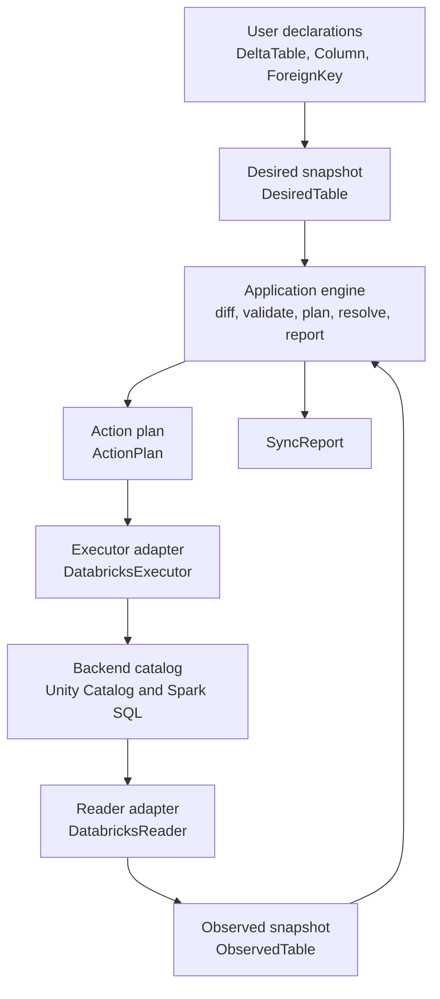
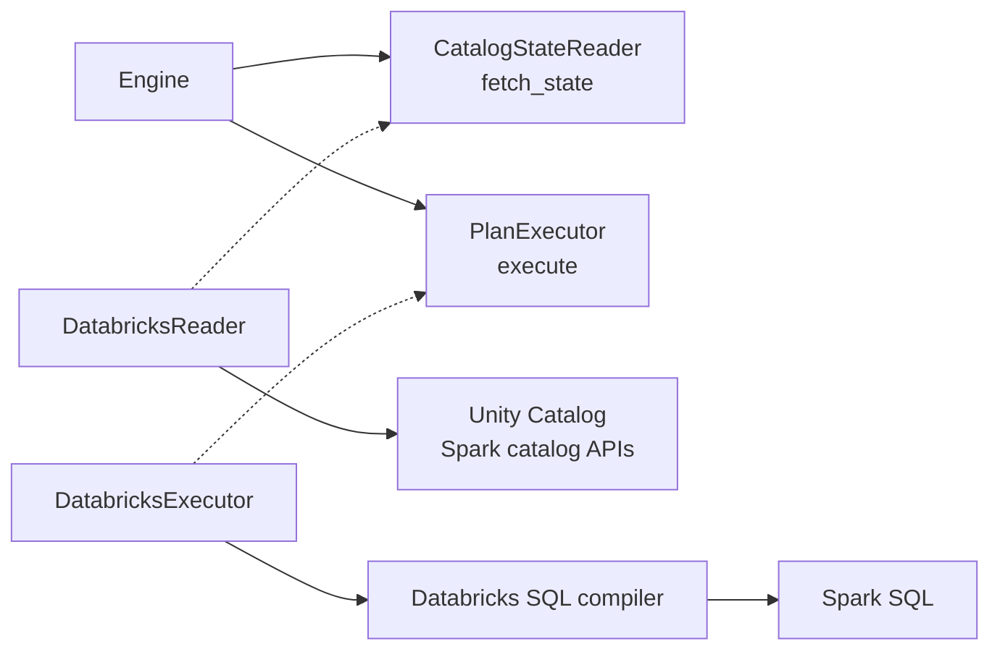
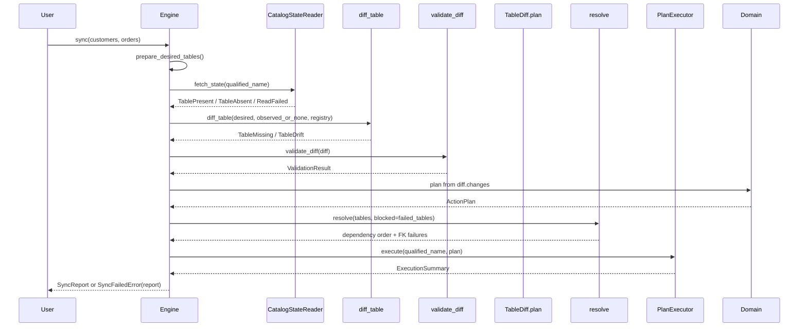
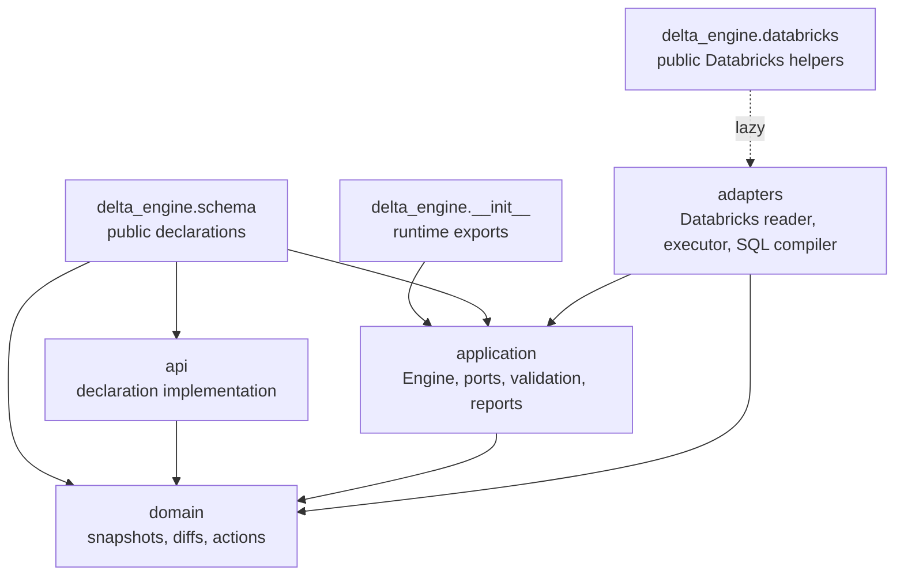
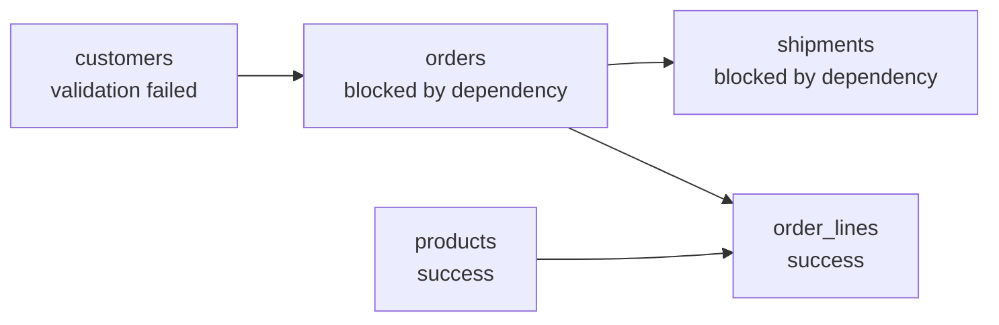

---
tags:
  - explanation
---

# Architecture

delta-engine is a small planning core wrapped in a hexagonal, or ports and
adapters, architecture. User code declares the state a table should have. An
adapter reads the state the catalog currently has. The engine compares those two
snapshots, validates the differences, turns the allowed differences into a
deterministic action plan, resolves foreign-key dependencies across tables, and
then asks an adapter to execute the plan.

The important separation is this:

- The **domain** knows how to represent tables, diffs, and schema-change actions.
- The **application** knows how to run a sync, apply safety policy, resolve
  dependencies, and report failures.
- The **adapters** know how a backend such as Databricks exposes catalog state
  and accepts DDL.
- The **public API** gives users a convenient way to describe desired tables
  without exposing the internal planning model directly.

That split keeps the planning code backend-free. Databricks is the first
adapter, not the center of the design.



## Core concepts

The architecture is easiest to follow if you start with the data that moves
through a sync.

| Concept | Role |
|---|---|
| `DeltaTable` | Public user declaration. It is the object users write in notebooks, scripts, and Python modules. |
| `DesiredTable` | Immutable domain snapshot of the target table state. `DeltaTable.to_desired_table()` lowers the public declaration into this shape. |
| `ObservedTable` | Immutable domain snapshot of the current catalog state. Reader adapters produce this after normalizing backend details. |
| `CatalogState` | The result of reading one table: `TablePresent`, `TableAbsent`, or `ReadFailed`. |
| `TableDiff` | Typed facts describing how desired and observed state differ. It is either `TableMissing` or `TableDrift`. |
| `Dimension` | One aspect of drift, such as columns, table comment, properties, tags, partitioning, primary key, or foreign keys. |
| `ValidationResult` | The application policy verdict for a diff. It says whether a drift is safe to plan in this run. |
| `ActionPlan` | The ordered, table-local actions that should be executed if the table is allowed to run. |
| `ResolveResult` | The foreign-key dependency order plus any FK-specific failures. |
| `ExecutionSummary` | The result of attempting a table's plan. It records successful actions and the first failed action, if execution failed. |
| `TableRunReport` | The complete per-table outcome, including read state, plan, failures, and execution. |
| `SyncReport` | The aggregate result for the whole sync. It is returned on success and attached to `SyncFailedError` on real-run failure. |

The table snapshots deliberately use domain vocabulary, not Spark vocabulary.
For example, the domain has `Column`, `QualifiedName`, `PrimaryKeyConstraint`,
`ForeignKeyConstraint`, and `DataType` values. The Databricks adapter is
responsible for translating Spark catalog objects and SQL type names into those
values before the engine sees them.

## The hexagonal boundary

The application owns the ports. Adapters implement them. The engine does not
call Spark, query `information_schema`, or compile SQL directly; it talks to the
two protocols in `delta_engine.application.ports`.



`CatalogStateReader.fetch_state(qualified_name)` returns one of:

- `TablePresent(table=ObservedTable(...))`
- `TableAbsent()`
- `ReadFailed(failure=ReadFailure(...))`

`PlanExecutor.execute(qualified_name, plan)` returns an `ExecutionSummary` with
one result per attempted action.

Both ports are **total**. Adapter implementations catch backend exceptions and
return typed failures instead of raising backend-specific exceptions through the
port. This is not just a convenience for callers. It is what lets one unreadable
or unmodifiable table fail while the engine keeps processing the rest of the
run and returns a complete report.

The Databricks adapter also owns backend normalization. It lowercases catalog
identifiers returned from Spark where needed, parses Spark DDL type strings into
domain data types, reads Unity Catalog constraints and tags, quotes SQL
identifiers, and turns Spark/Py4J exceptions into `ReadFailure` or
`ExecutionFailure` values.

### Type-model fidelity

The differ compares a declared table with an observed one, so every fact the
domain type model carries must survive the round trip
declaration → catalog → observation exactly. A fact that only one side can
carry is worse than an unmodeled one. Declarable but not observable: every
sync reports drift that is not there, and when the false drift is a blocked
change (a column type change, say) the table fails validation forever.
Observable but not declarable: the catalog permanently disagrees with the only
spelling a declaration can use. Facts that cannot round-trip are therefore
normalized out on both sides rather than modeled halfway.

`CHAR(n)` and `VARCHAR(n)` are the worked example. Delta stores both as
`STRING` and enforces the length bound as a write-time check, and Databricks
recommends `STRING` for new tables. Mapping them to their own domain types on
the read side only would make every observed varchar column drift against the
only declarable spelling (`String`) and fail validation permanently; modeling
them fully would mean owning length-transition safety rules for a type the
platform steers users away from. The reader instead observes both as `String`:
no drift, no `CHAR`/`VARCHAR` DDL is ever emitted, and the catalog keeps
enforcing the length. The trade-off is deliberate: a declaration cannot create
a varchar column, and an out-of-band length change is invisible to drift
detection.

`Struct` shows the same rule inside a modeled type. Struct fields carry name
and type only: the catalog reports column types as DDL text, which does not
reliably round-trip nested field nullability or comments, so declaring either
would produce a permanent, blocked `ColumnDataTypeChanged` against whatever
the reader observes. Both sides normalize to name + type instead — declared
fields are created nullable, nested comments are unmanaged, and modeling
field nullability waits until the reader observes a real `StructType` rather
than DDL text.

The model is also a pinned vocabulary while the catalog's keeps growing:
`TIMESTAMP_NTZ` and `VARIANT` both went from nonexistent to real column
types within the life of running tools, and the next addition will reach
tables before it reaches engines that pin a type model. An observed type
outside the model is therefore a routine lifecycle condition, not a defect,
and the reader handles it by how much the omission would distort the
snapshot: an ordinary unmappable column is skipped and left unmanaged (the
snapshot stays honest about everything else), but an unmappable partition
column fails the whole read — an incomplete `partitioned_by` would fabricate
partitioning drift, and a false blocked change is worse than an honest
`READ_FAILED`.

## Sync lifecycle

`Engine.sync(...)` is a phase chain. Before the chain begins, user-facing table
sources are prepared: each source is lowered with `to_desired_table()`, duplicate
qualified names are rejected, and the desired tables are sorted by qualified
name so reports and sync behavior do not depend on the order arguments were
passed.

After preparation, the engine runs six internal phases over private `_TableRun`
objects. A `_TableRun` is a mutable scratch pad for one table. It accumulates
read state, diff, plan, failures, and execution results before it is frozen into
an immutable `TableRunReport`.



The phases are:

1. **Prepare**: lower user-facing table declarations to `DesiredTable` values and
   reject duplicate qualified names.
2. **Read**: ask the reader port for the current catalog state of each table.
3. **Diff**: compute the typed `TableDiff` with `diff_table`.
4. **Validate**: judge the diff with `validate_diff`.
5. **Plan**: construct an `ActionPlan` by iterating `diff.changes` after validation.
6. **Resolve**: order tables by foreign-key dependency and block dependents of
   failed tables.
7. **Execute**: execute non-empty plans for tables that have no failures.
8. **Report**: return `SyncReport`, or raise `SyncFailedError` with the report on
   real runs that failed.

Execution is gated by accumulated failures. A table that failed read,
validation, or foreign-key resolution keeps its failure in the report and is
skipped during execution. The engine still processes other tables.

| Shape | Produced by | Consumed by | Purpose |
|---|---|---|---|
| `DeltaTable` | User code | Application preparation | Public declaration object |
| `DesiredTable` | API lowering | Domain planner, resolver, report | Target schema snapshot |
| `ObservedTable` | Reader adapter | Domain planner, report | Catalog schema snapshot |
| `TableDiff` | `diff_table` | Validation, Engine (changes) | Typed changes separating observed from desired |
| `ActionPlan` | Engine (from changes) | Executor, report | Ordered table-local changes |
| `CatalogState` | Reader port | Engine | Present, absent, or read-failed state |
| `ExecutionSummary` | Executor port | Engine, report | Attempted action outcomes |
| `SyncReport` | Engine | User code | Immutable run result |

## Package map

An `ActionPlan` is produced by iterating each change's `.actions()`; actions are sorted by `ActionPhase` (an `IntEnum`) then alphabetically by subject, producing a stable, predictable sequence regardless of declaration order.

| Package | Responsibility | Examples |
|---|---|---|
| `delta_engine.schema` | User-facing declaration import surface | `DeltaTable`, `ForeignKey`, `Property` |
| `delta_engine.api` | Declaration implementation package | `DeltaTable`, `ForeignKey`, `Property` |
| `delta_engine.application` | Use-case orchestration, ports, failures, validation, dependency resolution, reports | `Engine`, `CatalogStateReader`, `PlanExecutor`, `validate_diff`, `resolve`, `SyncReport` |
| `delta_engine.domain` | Backend-free snapshots, diffs, actions, and deterministic planning | `DesiredTable`, `ObservedTable`, `TableDiff`, `ActionPlan` |
| `delta_engine.adapters` | Backend integration and translation | `DatabricksReader`, `DatabricksExecutor`, SQL compiler |



The arrows show source dependencies. The domain does not import Spark,
Databricks, the application layer, or adapter code. Backend-specific code
depends inward on the application ports and domain vocabulary. The top-level
`delta_engine` package eagerly exposes backend-neutral runtime types such as
`Engine`, `SyncReport`, and `SyncFailedError`, so `import delta_engine` does not
require PySpark.

`delta_engine.schema` and `delta_engine.databricks` are the public import paths
for users. Their implementations still live in `delta_engine.api` and
`delta_engine.adapters.databricks`, respectively.

## Diff-first planning

Planning is two pure stages connected by a typed diff. `diff_table(desired,
observed, property_registry)` produces a `TableDiff` — `TableMissing` when the table does not
exist, else a `TableDrift` holding a flat tuple of changes. Each change is a
frozen dataclass recording one atomic difference (`ColumnAdded`,
`TableTagUnset`, `ColumnDataTypeChanged`, …) and carries two things: an
`aspect` naming the `TableAspect` it belongs to, and `.actions()` returning
the DDL steps that reconcile it. Changes with no in-place remedy (a column
type change, a partitioning change) return no actions — validation blocks
them instead. `*Changed` members carry both sides of the difference as one
atomic pair (`desired_*` / `observed_*`), so rules can read the direction and
report from/to values without correlating separate changes.

Whether a change is permitted is policy — `validate_diff` evaluates
precondition rules against the flat tuple, and rules match change types
directly (e.g. `ColumnDataTypeChangeNotSupported` scans for
`ColumnDataTypeChanged`; `PartitioningChangeNotSupported` scans for
`PartitioningChanged`). The engine constructs the `ActionPlan` by iterating
changes directly after validation — there is no separate `lower_diff` step and
no hidden dependency between lowering and validation.

Two aspects deliberately diff under different semantics. Properties are
exact-declaration: the declaration is the complete list of managed keys — a
declared value is reconciled, a declared ``None`` asserts absence (unset
when present), a managed key observed without a declaration is a blocking
change, and unmanaged keys (platform-written) are invisible. The reader
adapter filters unmanaged keys out of the observed state before the domain
sees them, and the properties diff runs only when the declaration manages
``PROPERTIES``. Tags are full-state (an observed-only tag is drift and is
unset).

## Managed aspects

Every `DesiredTable` carries a `managed_aspects` field: a `frozenset[TableAspect]`
naming the aspects the engine reconciles for that table. The differ
(`diff_table`) is scope-blind for every aspect except properties — the
properties diff runs only when the declaration manages `PROPERTIES` (see
Diff-first planning). The `TableDrift` it produces carries the `desired`
table itself (symmetric with `TableMissing`), so the diff is self-contained
and `validate_diff` takes only the diff. Scope awareness lives in
validation, as an unconditional invariant rather than an optional rule:
`validate_diff` fails the sync once per unmanaged aspect that has drifted
(`UnmanagedAspectDrift`), and rules read `drift.managed_changes` — so
unmanaged drift produces exactly one scope failure rather than also tripping
safety rules for changes the user never requested. If validation passes,
every change in the drift belongs to a managed aspect, so
`TableDrift.plan()` naturally produces only the managed actions, with no
filtering logic needed.

The public API exposes named modes only: `DeltaTable(metadata_only=True)` maps
to the metadata aspects (comments, tags, key constraints). The `TableAspect`
enum stays internal.

`diff_table(desired, observed, property_registry)` produces a `TableDiff`:

- `TableMissing` means the catalog has no table at that name.
- `TableDrift` means the table exists and carries a tuple of drift dimensions.

The diff states facts only. It does not decide whether the facts are safe, and
it does not talk to the backend. For an existing table, dimensions cover:

- columns
- table comment
- table properties
- table tags
- partitioning
- primary key
- foreign keys

Each dimension owns its local lowering to actions. For example, column additions
produce `AddColumn` plus any column tag actions, table tag removals produce
`UnsetTableTag`, and foreign-key additions produce `SetForeignKey`. Some facts
produce no actions because they are intentionally blocked by validation policy:
in-place data type changes and partitioning changes are represented in the diff
but have no direct action.

`validate_diff` is where policy lives. A missing table passes automatically
because creating a table from its full declaration is safe. A drift is evaluated
by the rules in `DEFAULT_RULES`, which currently reject:

- adding a non-nullable column to an existing table
- tightening an existing column to `NOT NULL`
- changing an existing column's data type in place
- changing table partitioning in place

Only after validation passes does the engine call `diff.plan()`.

## Deterministic action plans

An `ActionPlan` owns action ordering. Callers do not sort actions manually.

Every action declares two ordering fields:

- `phase`: an `ActionPhase` value that encodes dependency order between kinds of
  DDL.
- `subject`: the table-local name targeted by that action, such as a column,
  property, tag, or constraint name.

`ActionPlan` sorts actions by phase and then by subject. This makes plans
stable even when declarations or dictionaries arrive in different orders.

The phase ordering exists because backend DDL has dependencies:

- Table creation comes before follow-up tag and foreign-key actions for a
  missing table.
- Foreign keys are dropped before primary keys and column drops, because a
  referenced key or column cannot be dropped while an FK still points at it.
- Primary keys are dropped before column mutations, so no key references a
  column being dropped or altered.
- Column nullability changes run before primary keys are set, because primary
  key columns must be non-nullable.
- Foreign keys are set last, after the referenced primary key exists.

The domain plan describes intent. The adapter compiler decides how each action
is rendered for its backend.

## Foreign-key dependencies

Foreign keys affect both table-local SQL order and cross-table sync order.

Within a table, FK actions are ordered by `ActionPhase`: drops happen early and
sets happen late. Across tables, the application resolver orders referenced
tables before dependents so a dependent table does not try to add a foreign key
before a target that is already known to be unable to run.



The resolver builds a graph from desired foreign keys and uses strongly
connected components to produce a dependency-first order. It reports:

- `UNRESOLVABLE_REFERENCE` when a foreign key points to a table that is not part
  of the sync.
- `REFERENCED_COLUMNS_NOT_A_KEY` when the referenced columns are not exactly the
  referenced table's primary key.
- `CYCLE` for true multi-table FK cycles.
- `BLOCKED_BY_FAILED_DEPENDENCY` when a table depends on another table that
  is already known to have failed before execution begins, such as a table with
  a read failure, validation failure, unresolvable FK, invalid FK target, or FK
  cycle.

Each rule implements the `Rule` protocol: a `name` `ClassVar[str]` and an `evaluate(changes: tuple[Change, ...]) -> tuple[ValidationFailure, ...]` method. Rules scan the flat change tuple directly — typically matching a specific change type with `isinstance` — and return all violations at once, avoiding a fix-and-rerun cycle per failure.

`validate_diff` dispatches on the diff variant first: a `TableMissing` passes automatically when column structure is managed — creating a table from its full declaration is always safe — and fails with `MissingTableUnmanaged` when it is not, so no rule ever sees a missing table. For a `TableDrift`, `validate_diff` calls every rule in `DEFAULT_RULES` with the drift's managed changes and aggregates their failures into a `ValidationResult`.

Execution happens after resolution, and there is no second dependency pass after
an execution failure. A dependency's execution failure is recorded on that
dependency's report, but it is not retroactively converted into
`BLOCKED_BY_FAILED_DEPENDENCY` failures on later tables in the same run.

## Public declarations and lowering

`DeltaTable` is the public declaration object, but the engine plans with
`DesiredTable`. The lowering boundary does several important things up front:

- rejects property keys the engine does not manage (valued or ``None``),
  and rejects ``metadata_only=True`` combined with ``properties``
- generates a primary-key constraint from columns marked `primary_key=True`
- lowers public `ForeignKey` declarations into domain `ForeignKeyConstraint`
  values
- validates structural invariants such as non-empty columns, unique column
  names, valid partition columns, valid FK local columns, and non-nullable
  primary-key columns

A `ForeignKey` declares its target by passing the referenced `DeltaTable` object
directly, or the `Self` sentinel for a self-reference:

```python
customers = DeltaTable(
    catalog="dev",
    schema="silver",
    name="customers",
    columns=[...],
)

orders = DeltaTable(
    catalog="dev",
    schema="silver",
    name="orders",
    columns=[...],
    foreign_keys=[
        ForeignKey(local_columns=("customer_id",), references=customers),
    ],
)
```

This object reference lets the API infer the referenced columns from the
referenced table's primary key. The declaration does not repeat those columns,
so it cannot drift from the target table's primary-key declaration. The tradeoff
is that the referenced table must be declared in Python scope. Within one module
that usually means defining the parent before the child; across modules it means
importing the referenced table.

This source-code order does not determine execution order. The engine sorts
prepared desired tables by qualified name for deterministic setup, then the
resolver topologically orders them by FK dependency before execution.

References by dotted name are intentionally not supported in this iteration. If
that becomes necessary, the API can be widened to accept a `QualifiedName` as an
additional branch. That would be backward-compatible, but it would also need
explicit referenced columns because a bare name carries no primary key object to
inspect.

## Constraint names

Constraint names are data, not hidden compiler policy.

For desired tables, the API layer generates names when a `DeltaTable` is lowered
to a `DesiredTable`:

- primary key: `{table}_pk`
- foreign key: `{table}_{local_columns}_fk`

For observed tables, the reader adapter reads constraint names from the catalog.
After that, names live on `PrimaryKeyConstraint` and `ForeignKeyConstraint`
objects. The differ and SQL compiler read the names directly instead of
deriving them again.

The diff uses constraint content, not names alone, to decide identity:

- primary-key identity is the set of key columns; declaration order and
  constraint name do not make two primary keys different.
- foreign-key identity is the signature of local columns, referenced table, and
  referenced columns; an unchanged FK with a different catalog constraint name
  stays idempotent.

This keeps naming policy at the boundary where the domain model is populated and
keeps downstream planning focused on schema facts.

## Reporting and failure semantics

Failures are phase-tagged application values. A `TableRunReport` derives its
status from the earliest failing phase:

- `READ_FAILED`
- `VALIDATION_FAILED`
- `FOREIGN_KEY_FAILED`
- `EXECUTION_FAILED`
- `SUCCESS`

The report keeps the full failure tuple, not just the status. That matters when
a table has multiple validation failures or multiple FK failures. For execution,
the Databricks executor stops at the first failed action because the engine is
not transactional and later actions may depend on earlier ones. The
`ExecutionSummary` records all attempted actions up to that point.

Reports also keep the plan even when execution does not happen. That makes dry
runs useful and makes failed runs explainable: a user can inspect what would
have happened, which phase blocked it, and which downstream tables were blocked
as a result.

## Lazy PySpark imports

The top-level `delta_engine` package is designed to be importable without
PySpark installed. It eagerly exports backend-neutral runtime objects,
including `Engine`, `SyncReport`, and `SyncFailedError`. Schema declarations
live in `delta_engine.schema`, which is also PySpark-free.

Databricks helpers live in the adapter package and import PySpark. The
preferred import path is `delta_engine.databricks`, whose public functions
import the real adapter only when called:

- `build_engine`
- `configure_logging`

Calling the Databricks factory imports `delta_engine.adapters.databricks` on
demand. Plain table declarations and schema-only tests do not pay that
dependency cost.

## Where to make changes

| Change | Main location | Notes |
|---|---|---|
| Add a new backend | `delta_engine.adapters` | Implement `CatalogStateReader` and `PlanExecutor`; keep backend exceptions inside the adapter. |
| Add a new change type | `delta_engine.domain.plan.diff` | Add a frozen dataclass with an `aspect` `ClassVar[TableAspect]` and an `actions()` method; add it to the `Change` union and emit it from the relevant `_diff_*` helper. If the change is currently unsupported, add a rule to `validation.py`. No other files change. |
| Add a new action type | `delta_engine.domain.plan` and adapter compiler | Define the action and phase in `actions.py`, emit it from the relevant change's `actions()` method, then compile it in the backend adapter. |
| Add a safety rule | `delta_engine.application.validation` | Rules inspect the `TableDrift` changes and return `ValidationFailure` values. |
| Add a data type | `delta_engine.domain.model.data_type` and adapter type mapping | The domain type is backend-free; SQL names and Spark parsing live in the Databricks adapter. |
| Change public declarations | `delta_engine.api`, surfaced only through `delta_engine.schema` | Keep public ergonomics in `delta_engine.schema` and lower choices into domain snapshots before the engine phases begin. |
| Change FK ordering or blocking | `delta_engine.application.dependency_resolution` | Cross-table dependency policy lives in the application layer, not in the domain plan or SQL compiler. |
| Change report output | `delta_engine.application.report` and `delta_engine.application.rendering` | Keep display formatting out of domain objects. |
| Change Databricks SQL | `delta_engine.adapters.databricks.sql` | Compile domain actions to backend statements at the adapter boundary. |

## Architectural rules

- Keep PySpark and Databricks imports inside `delta_engine.adapters`.
- Keep the domain backend-free, immutable, and deterministic.
- Put orchestration, safety policy, dependency resolution, and failure
  propagation in the application layer.
- Put backend normalization at adapter boundaries, such as lowercasing catalog
  identifiers, parsing Spark types, and quoting SQL.
- Return typed failures across ports instead of raising backend exceptions.
- Let `ActionPlan` own action ordering; callers should not sort plans manually.
- Keep user-facing schema convenience in `delta_engine.schema`, then lower to
  domain snapshots before planning begins.
