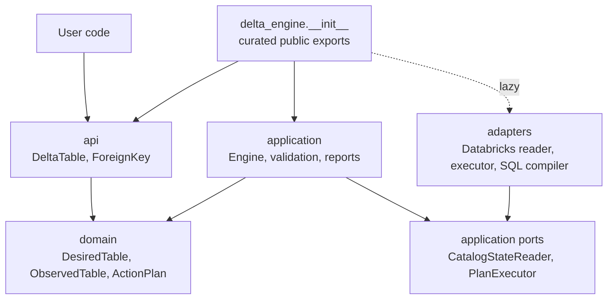
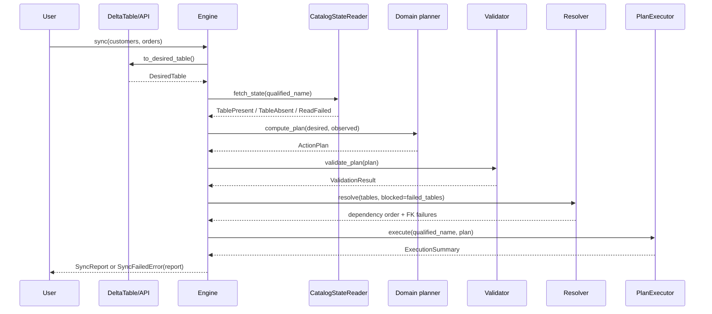
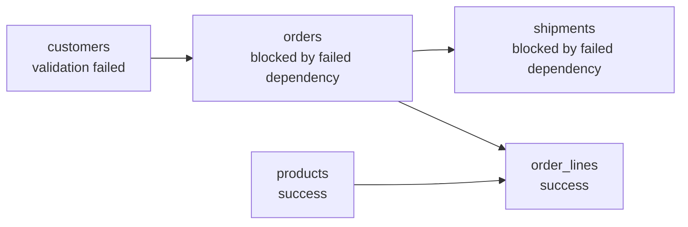

---
tags:
  - explanation
---

# Architecture

delta-engine uses a hexagonal (ports and adapters) architecture layered over a
small domain model. The goal is to keep the planning core independent of any
backend, so a Databricks implementation can be replaced or extended without
changing the domain or application orchestration.

## Package structure

Most code lives in one of four packages:

| Package | Responsibility | Examples |
|---|---|---|
| `delta_engine.api` | User-facing declarations and import surface | `DeltaTable`, `ForeignKey`, `Property` |
| `delta_engine.application` | Use-case orchestration, ports, failures, reports | `Engine`, `CatalogStateReader`, `PlanExecutor`, `validate_plan`, `resolve` |
| `delta_engine.domain` | Backend-free schema snapshots, action plans, and diffing | `DesiredTable`, `ObservedTable`, `ActionPlan`, `compute_plan` |
| `delta_engine.adapters` | Backend integration and translation | `DatabricksReader`, `DatabricksExecutor`, SQL compiler |



The arrows show dependencies. Backend-specific code depends inward on the
application ports and domain vocabulary; the domain does not depend on Spark,
Databricks, or adapter code. The top-level `delta_engine` package eagerly exposes
the pure-Python API and application surface, and lazily exposes Databricks helpers
so importing table declarations does not require PySpark.

## Hexagonal boundary

The application owns the ports. Adapters implement them; the engine only sees the
protocols and typed return values.

```mermaid
flowchart LR
    Engine[Engine] --> ReaderPort[CatalogStateReader<br/>fetch_state]
    Engine --> ExecutorPort[PlanExecutor<br/>execute]
    ReaderPort <|.. Reader[DatabricksReader]
    ExecutorPort <|.. Executor[DatabricksExecutor]
    Reader --> Catalog[Unity Catalog / Spark catalog]
    Executor --> Compiler[SQL compiler]
    Compiler --> Spark[Spark SQL]
```

`CatalogStateReader.fetch_state(qualified_name)` returns one of:

- `TablePresent(table=ObservedTable(...))`
- `TableAbsent()`
- `ReadFailed(failure=ReadFailure(...))`

`PlanExecutor.execute(qualified_name, plan)` returns an `ExecutionSummary` with
one result per attempted action. Both ports are **total**: implementations catch
backend exceptions and return typed failures instead of raising. That boundary is
what lets one table fail while the engine continues reading, planning, and
reporting the rest of the run.

## Sync lifecycle

`Engine.sync(...)` is a phase chain. Each table gets a private run object during
the sync; that run accumulates read state, a plan, failures, and execution
results before being frozen into a public `TableRunReport`.



The phases are:

1. **Prepare**: lower user-facing table declarations to `DesiredTable` values and
   reject duplicate qualified names.
2. **Read**: ask the reader port for the current catalog state of each table.
3. **Plan**: diff desired state against observed state with `compute_plan`.
4. **Validate**: reject unsafe plans before SQL runs.
5. **Resolve**: order tables by foreign-key dependency and block dependents of
   failed tables.
6. **Execute**: execute non-empty plans for tables that have no failures.
7. **Report**: return `SyncReport`, or raise `SyncFailedError` with the report on
   real runs that failed.

## Boundary data shapes

| Shape | Produced by | Consumed by | Purpose |
|---|---|---|---|
| `DeltaTable` | User code | Application preparation | Public declaration object |
| `DesiredTable` | API lowering | Domain planner, resolver, report | Target schema snapshot |
| `ObservedTable` | Reader adapter | Domain planner, report | Catalog schema snapshot |
| `ActionPlan` | `compute_plan` | Validation, executor, report | Ordered table-local changes |
| `CatalogState` | Reader port | Engine | Present, absent, or read-failed state |
| `ExecutionSummary` | Executor port | Engine, report | Attempted action outcomes |
| `SyncReport` | Engine | User code | Immutable run result |

## Planning and determinism

`compute_plan(desired, observed)` diffs the desired declaration against the observed catalog state and returns an `ActionPlan`. Actions are sorted by `ActionPhase` (an `IntEnum`) then alphabetically by subject, producing a stable, predictable sequence regardless of declaration order.

The phase ordering encodes dependency constraints. Each ordering below exists because Databricks rejects the operation otherwise:

- **Foreign keys are dropped first** (before primary key and column drops): a foreign key may reference a column or primary key that a later phase drops, and Databricks rejects dropping anything still referenced by an active foreign key constraint.
- **Primary key drops run before column mutations**, so no constraint references a column being dropped.
- **Primary key sets run after nullability changes**, so columns are guaranteed non-nullable before the constraint is applied.
- **Foreign keys are set last** (after the primary key is set): a foreign key references a primary or unique key, so that key must exist before the foreign key can point at it.

## Sentinel actions

`ColumnTypeChange`, `PartitioningChange`, `TargetTableMissing`, `TargetColumnMissing`, and `UnenforceablePrimaryKey` are actions that are never executed. The differ emits them to describe drift it detected — a column whose type differs, or a changed partition spec — without judging whether that drift is allowed; deciding what is permitted is the validation layer's job (`UnsupportedColumnTypeChange` and `DisallowPartitioningChange` reject them with a clear message). The SQL compiler raises `AssertionError` if either reaches compilation — encoding the invariant that validation always runs first. The three broken-target actions describe managed metadata that cannot land — a missing table, a missing column, or a primary key over live-nullable columns — and are emitted only when column structure is unmanaged.

## Managed aspects

Every `DesiredTable` carries `managed_aspects`, a `frozenset[TableAspect]`
naming the dimensions of table state the engine reconciles for that table:
column structure, table comment, column comments, table tags, column tags,
properties, partitioning, primary key, foreign keys. The differ runs each
diff dimension only when its aspect is managed; unmanaged dimensions are
ignored entirely (not diffed, so never blocked). The default is all aspects —
full management.

Scope controls what the differ reads, not what gets lowered: the public API
always lowers the complete declaration, so "unset" (an empty tags mapping
means remove all tags) and "unmanaged" (the aspect is out of scope) stay
distinct. The public API exposes named modes only — `DeltaTable(
metadata_only=True)` maps to the metadata aspects (comments, tags, keys) —
and the enum stays internal.

## Constraint-name generation

A key constraint's name is a pure function of the table name and its columns (`{table}_pk` for primary keys, `{table}_{columns}_fk` for foreign keys). It is generated by the API layer when a `DeltaTable` is lowered to a `DesiredTable`, and read from the catalog for observed constraints. Either way, the name arrives as data on the constraint object — the differ and SQL compiler read it directly rather than deriving it. This means the name is set exactly once, at the boundary where the domain model is first populated, and nothing downstream needs to reason about naming policy.

## Foreign key references

A `ForeignKey` declares its target by passing the referenced `DeltaTable` object directly (or the `Self` sentinel for a self-reference), not a dotted `catalog.schema.table` string:

```python
customers = DeltaTable(catalog="dev", schema="silver", name="customers", columns=[...])
orders = DeltaTable(
    ...,
    foreign_keys=[ForeignKey(local_columns=("customer_id",), references=customers)],
)
```

This is a deliberate design choice. An object reference makes the dependency explicit and lets the engine infer the referenced columns from the referenced table's primary key, so the declaration never restates them. The cost is that the referenced table must be declared as a `DeltaTable` in scope: within a module you declare the parent before the child, and a cross-module reference becomes an import. Note this constrains only the *source* order in which tables are declared — the engine still topologically sorts the actual sync order during dependency resolution, so a referenced table is always synced before its dependents regardless of declaration order.

References by name are intentionally not supported in this iteration. If they are ever needed — for a table declared in another module, or one that exists in the catalog but is not managed here — the `references` union can be widened to also accept a `QualifiedName`. That is a backward-compatible addition: existing object-reference declarations keep working, and the new branch would require explicit referenced columns, since a bare name carries no primary key to infer from.

## Foreign key dependency resolution

Foreign keys affect table order, not just table-local SQL order. A referenced
table must be synced before a dependent table tries to apply its FK constraint.
Resolution also propagates failures: if a dependency cannot reach its desired
state in this run, every downstream table that depends on it is blocked.



The resolver treats read failures, validation failures, FK failures, and
execution failures as table-level blockers for downstream FKs. It still includes
every registered table in the final report, so users can see the full blast
radius in one run.

## Validation

Each rule implements a `Rule` protocol: a `name` class variable and an `evaluate(plan)` method returning zero or more `ValidationFailure` objects. `validate_plan` runs all rules in `DEFAULT_RULES` and aggregates failures. Rules receive the full plan, so they can reason across actions (e.g. "does this plan add a NOT NULL column to a table that already exists?").

## Lazy pyspark import

`delta_engine.__init__` uses PEP 562 `__getattr__` to defer import of `build_databricks_engine` and `configure_logging` until first access. This means `import delta_engine` and table declarations work without a Spark install — useful for testing and schema-only environments.

## Where to make changes

| Change | Main location | Notes |
|---|---|---|
| Add a new backend | `delta_engine.adapters` | Implement `CatalogStateReader` and `PlanExecutor`; keep backend exceptions inside the adapter. |
| Add a new action type | `delta_engine.domain.plan` and adapter compiler | Define the action and phase in the domain, emit it from the differ, then compile it in the backend adapter. |
| Add a safety rule | `delta_engine.application.validation` | Rules inspect `ActionPlan` and return `ValidationFailure` values. |
| Add a data type | `delta_engine.domain.model.data_type` and adapter type mapping | The domain type is backend-free; SQL names and Spark parsing live in the Databricks adapter. |
| Change public declarations | `delta_engine.api` | Lower public API choices into domain snapshots before the engine phases begin. |
| Change report output | `delta_engine.application.report` / `rendering` | Keep display formatting out of domain objects. |

## Architectural rules

- Keep PySpark and Databricks imports inside `delta_engine.adapters`.
- Keep the domain backend-free and deterministic.
- Put orchestration and failure policy in the application layer.
- Put backend normalization at adapter boundaries, such as lowercasing catalog
  identifiers or mapping Spark types to domain types.
- Return typed failures across ports instead of raising backend exceptions.
- Let `ActionPlan` own action ordering; callers should not sort plans manually.
