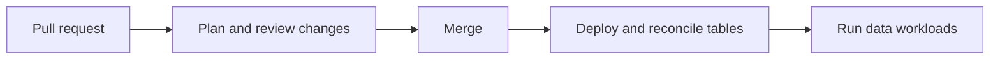
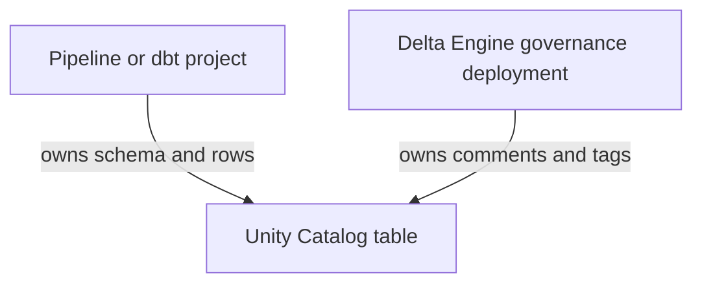

---
tags:
  - explanation
---

# Ways to use Delta Engine

Delta Engine is a reconciliation library rather than a deployment system or
background controller. A sync runs only when your application, workflow, or
deployment process calls it with a collection of table declarations.

This makes Delta Engine flexible about where it fits. A team can reconcile
table contracts as part of a release, make table readiness a prerequisite of an
ETL workflow, or manage governance metadata around tables whose structure is
owned elsewhere.

The patterns below are not mutually exclusive. A project might plan changes in
CI, apply them through a dedicated release job, and use a separate restricted
deployment for centrally managed annotations.

## Choose a pattern

| Pattern                                                                                             | Best suited to                                                       | Where Delta Engine runs                                  |
| --------------------------------------------------------------------------------------------------- | -------------------------------------------------------------------- | -------------------------------------------------------- |
| [Pattern 1: Release table contracts](#pattern-1-release-table-contracts-with-the-application)       | Controlled production releases and continuing table estates          | A dedicated job after the application bundle is deployed |
| [Pattern 2: Reconcile a target table](#pattern-2-reconcile-a-target-table-before-its-etl-runs)      | ETL applications that own a single target table                      | Application startup before transformations or writes     |
| [Pattern 3: Reuse declarations in ETL](#pattern-3-reuse-table-declarations-throughout-etl-code)     | ETL applications that use declared schema and row identity at write time | Transformation and write code                         |
| [Pattern 4: Use declarations in tests](#pattern-4-use-table-declarations-in-unit-tests)              | ETL applications that test schemas, required values, and relationships | Unit tests                                            |
| [Pattern 5: Add governance](#pattern-5-add-governance-without-taking-over-the-pipeline)              | Split ownership between data-product, platform, and governance teams | A separate restricted-scope deployment                   |

## Pattern 1: Release table contracts with the application

For most production applications, the clearest pattern is to treat table
contracts as part of the release.



The declarations, pipeline code, and deployment configuration are versioned and
released together. The deployment creates or updates the Databricks resources,
then runs a dedicated job that reconciles the table declarations before the new
data-producing workload is allowed to run.

This keeps responsibilities clear:

* the bundle deploys jobs, pipelines, libraries, and configuration;
* the reconciliation job manages the declared table state;
* the ETL workloads produce and write rows.

### Keep an explicit table registry

Expose the tables owned by the release through one explicit, ordered
collection:

```python
# myproject/table_registry.py
from myproject.tables.customers import customers
from myproject.tables.order_items import order_items
from myproject.tables.orders import orders

ALL_TABLES = (
    customers,
    orders,
    order_items,
)
```

An explicit registry makes the release boundary visible in code review: adding
a table to the collection is an intentional decision to include it in the
deployment.

### Add a reconciliation entry point

Package the reconciliation logic with the application:

```python
# myproject/sync_tables.py
from delta_engine import render_report
from delta_engine.databricks import build_spark_engine
from pyspark.sql import SparkSession

from myproject.table_registry import ALL_TABLES


def main() -> None:
    """Reconcile every table owned by this release."""
    spark = SparkSession.builder.getOrCreate()

    engine = build_spark_engine(spark)
    report = engine.sync(*ALL_TABLES)

    print(render_report(report))
```

The job succeeds only when the sync succeeds. If reading, planning, dependency
resolution, or execution fails, Delta Engine raises `SyncFailedError`, and the
job should fail rather than allowing the release to continue silently.

### Deploy and run it through a bundle

A Declarative Automation Bundle can deploy the application wheel and configure
the reconciliation entry point as a dedicated Python wheel task.

The release pipeline can then validate the bundle, deploy it, and run the
reconciliation job:

```bash
databricks bundle validate --target production
databricks bundle deploy --target production
databricks bundle run --target production reconcile_tables
```

Bundle deployment and table reconciliation are separate operations. If the
bundle is deployed but the reconciliation job fails, the new job definitions
and application artifacts may already exist in the workspace. The release
process should stop, expose the failed `SyncReport`, and prevent the updated
data workload from starting until the declaration or catalog problem is
resolved.

### Plan the same registry in CI

The same registry can be planned during a pull request through the read-only
CLI:

```bash
delta-engine plan myproject.table_registry:ALL_TABLES
```

This reads live Unity Catalog state, validates the declarations, and prints the
semantic differences and exact planned DDL without applying them.

A real sync does not replay the dry-run output as a saved plan. It reads the
catalog again and derives a fresh plan from the state present at deployment
time. See [How to report schema plans in CI](how-to-gate-changes-in-ci.md) for
a complete read-only workflow.

## Pattern 2: Reconcile a target table before its ETL runs

When an ETL application owns a single target table, it can reconcile that table
once at startup before performing transformations or writing any rows:

```text
ETL job starts
        ↓
reconcile target table
        ↓
run transformations
        ↓
write rows
```

Keep the table declaration alongside the ETL code and import it into the
application entry point:

```python
# myproject/main.py
from delta_engine.databricks import build_spark_engine
from pyspark.sql import SparkSession

from myproject.pipeline import run_pipeline
from myproject.tables.customers import customers


def main() -> None:
    """Reconcile the target table, then run the ETL pipeline."""
    spark = SparkSession.builder.getOrCreate()

    engine = build_spark_engine(spark)
    engine.sync(customers)

    run_pipeline(spark)
```

If the table is missing, Delta Engine creates it. If it has safe, supported
drift, Delta Engine reconciles it. If it already matches the declaration, the
sync applies no DDL and the ETL continues normally.

If the declaration is invalid, the live table cannot be read, the proposed
transition is unsafe, or execution fails, `SyncFailedError` propagates and the
ETL stops before `run_pipeline()` begins.

This pattern gives the ETL application a clear startup precondition:

> The target table must exist and match its declared contract before the
> application writes any data.

### Synchronize dependencies together

An ETL that owns one independent target normally needs to synchronize only that
table:

```python
engine.sync(customers)
```

Pass multiple declarations when the target has cross-table dependencies that
Delta Engine must validate and order. For example, if `orders` declares a
foreign key to `customers`, synchronize both declarations in the same run:

```python
engine.sync(customers, orders)
```

Delta Engine validates the relationship, places the parent before the dependent,
and prevents `orders` from executing if `customers` cannot reach its desired
state.

There is no need to synchronize unrelated tables together merely because they
belong to the same repository. Each ETL can reconcile its own target, while
related tables are grouped only where their declarations depend on one another.

### When this pattern works well

Use this pattern when:

* one ETL application clearly owns one target table;
* the application should be able to start in a new environment where the table
  does not yet exist;
* table validity should be checked before every ETL run;
* the job runs at a frequency where the additional catalog read and planning
  step are acceptable;
* the runtime identity is permitted both to reconcile the table and write its
  data.

It is particularly straightforward for batch applications because the table
check becomes part of the application's normal startup sequence.

## Pattern 3: Reuse table declarations throughout ETL code

A `DeltaTable` declaration can also be imported throughout the ETL that
produces it. Table names, schemas, keys, and column lists then stay in one
place rather than being repeated across the pipeline.

### Conform output to the declared schema

Use the declaration to cast and order the final DataFrame before writing it:

```python
result = transform(source).to(to_spark_schema(customers))
```

### Build merges from the declared primary key

Use the same primary key declared on the table to construct the Delta merge
condition. This handles composite keys without maintaining a separate join
predicate:

```python
from functools import reduce
from operator import and_

from pyspark.sql import functions as F


condition = reduce(
    and_,
    (
        F.col(f"target.{column}") == F.col(f"source.{column}")
        for column in customers.primary_key
    ),
)

(
    target.alias("target")
    .merge(result.alias("source"), condition)
    .whenMatchedUpdateAll()
    .whenNotMatchedInsertAll()
    .execute()
)
```

### Derive update columns from the declaration

When a merge should not update key columns, derive the mutable columns instead
of maintaining another list:

```python
update_columns = [
    column.name
    for column in customers.columns
    if column.name not in customers.primary_key
]

updates = {
    column: F.col(f"source.{column}")
    for column in update_columns
}

(
    target.alias("target")
    .merge(result.alias("source"), condition)
    .whenMatchedUpdate(set=updates)
    .whenNotMatchedInsertAll()
    .execute()
)
```

### Reuse the key wherever row identity matters

The declared primary key can also drive deduplication, windowing, and other
key-based ETL logic. For example, retain the latest event for each customer:

```python
from pyspark.sql import Window, functions as F


latest = Window.partitionBy(*customers.primary_key).orderBy(
    F.col("event_timestamp").desc()
)

result = result.withColumn("_row_number", F.row_number().over(latest))
```

## Pattern 4: Use table declarations in unit tests

The same `DeltaTable` used by production code can define the schemas, keys,
and relationships expected by ETL tests. Tests can therefore work from the
real table contract instead of maintaining separate schemas and column lists.

### Create test DataFrames from declared schemas

Use the declared Spark schema when creating test fixtures:

```python
source = spark.createDataFrame(
    [
        (1, "Alice"),
        (2, "Bob"),
    ],
    schema=to_spark_schema(customers),
)
```

### Assert the ETL produces the declared schema

Compare the final DataFrame with the same table contract:

```python
def test_produces_the_declared_schema(source) -> None:
    # When
    result = transform(source)

    # Then
    assert result.schema == to_spark_schema(customers)
```

A schema change now changes the production contract and the test expectation
in one place.

### Test non-nullable columns

Use the declaration to derive which columns must always contain a value:

```python
def test_produces_no_nulls_in_required_columns(source) -> None:
    # When
    result = transform(source)

    # Then
    required_columns = [
        column.name
        for column in customers.columns
        if not column.nullable
    ]

    for column in required_columns:
        assert result.filter(F.col(column).isNull()).isEmpty()
```

### Test primary-key uniqueness

The declared primary key can drive data-level key checks:

```python
def test_produces_unique_primary_keys(source) -> None:
    # When
    result = transform(source)

    # Then
    duplicates = (
        result
        .groupBy(*customers.primary_key)
        .count()
        .filter(F.col("count") > 1)
    )

    assert duplicates.isEmpty()
```

### Test foreign-key relationships

Related table declarations can also drive referential-integrity tests. For a
foreign key whose local and referenced columns have the same names:

```python
def test_produces_valid_customer_references(
    orders_result,
    customers_result,
) -> None:
    missing_customers = (
        orders_result
        .join(
            customers_result,
            on=list(orders.foreign_keys[0].columns),
            how="left_anti",
        )
    )

    assert missing_customers.isEmpty()
```

## Pattern 5: Add governance without taking over the pipeline

Table ownership is not always all-or-nothing. A data-product team may own the
schema and row production while a platform or governance team owns comments,
classifications, and ownership tags.

Restricted scopes let those responsibilities remain separate:



For example, a pipeline can continue to define and populate an `orders` table
while a separate declaration manages its annotations:

```python
from delta_engine.schema import Column, DeltaTable, Long, String

orders_annotations = DeltaTable(
    catalog="production",
    schema="sales",
    name="orders",
    columns=[
        Column(
            "order_id",
            Long(),
            nullable=False,
            comment="Stable identifier for an order.",
            tags={"classification": "identifier"},
        ),
        Column(
            "customer_email",
            String(),
            comment="Email supplied when the order was placed.",
            tags={"classification": "personal"},
        ),
    ],
    comment="Customer orders accepted by the commerce platform.",
    tags={
        "domain": "sales",
        "owner": "commerce-platform",
    },
    scope="annotations",
)
```

With `scope="annotations"`, Delta Engine can reconcile table and column comments
and tags, but it cannot add, remove, or alter columns, properties, layouts, or
constraints.

Other available scopes include:

| Scope         | Managed state                       |
| ------------- | ----------------------------------- |
| `full`        | Complete table definition           |
| `metadata`    | Comments, tags, and key constraints |
| `annotations` | Comments and tags                   |
| `tags`        | Tags only                           |

See [How to deploy metadata only](how-to-deploy-metadata-only.md) for the exact
scope semantics.

### Mirror the table state you do not own

A restricted declaration still describes the live table accurately. Its
columns, layout, and any keys must match the state owned by the producing
system, even though Delta Engine is not allowed to alter those aspects.

If the pipeline changes the schema and the governance declaration is not
updated, the next sync fails rather than applying metadata against a table it
no longer understands. This makes the ownership boundary safe, but it also
means governance declarations must follow intentional changes made by the
structural owner.

### Use restricted scopes for streaming tables

Databricks streaming tables are structurally owned by their defining pipeline.
Delta Engine can manage their externally alterable comments and tags through
`scope="annotations"` or `scope="tags"`, but broader scopes are rejected.

Do not declare the same comment or tag in both the pipeline definition and
Delta Engine. A pipeline refresh can reassert its own declaration, creating
recurring drift between two competing owners.

## Operational boundaries

Whichever pattern you use:

* Keep one write-capable sync per table at a time.
* Treat a dry run as a live preview, not as an immutable saved plan.
* Do not allow another tool to evolve an aspect that Delta Engine manages.
* Do not run reconciliation inside every streaming micro-batch.
* Prefer explicit table registries over implicit package crawling.
* Do not describe a multi-statement table plan or multi-table run as
  transactionally atomic.
* Inspect the returned `SyncReport`; successful process startup is not a
  substitute for checking the reconciliation result.

See [Getting started](tutorial-getting-started.md) for a complete first sync,
[How a sync works](explanation-sync-lifecycle.md) for the execution model, and
[Capabilities and limitations](reference-limitations.md) before using
write-capable synchronization in an unattended production workflow.
