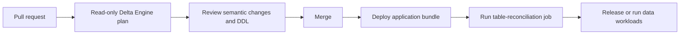
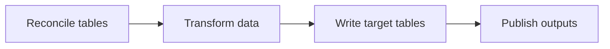
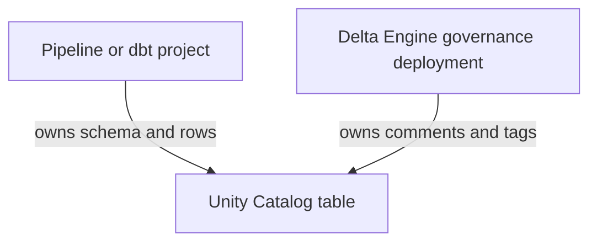
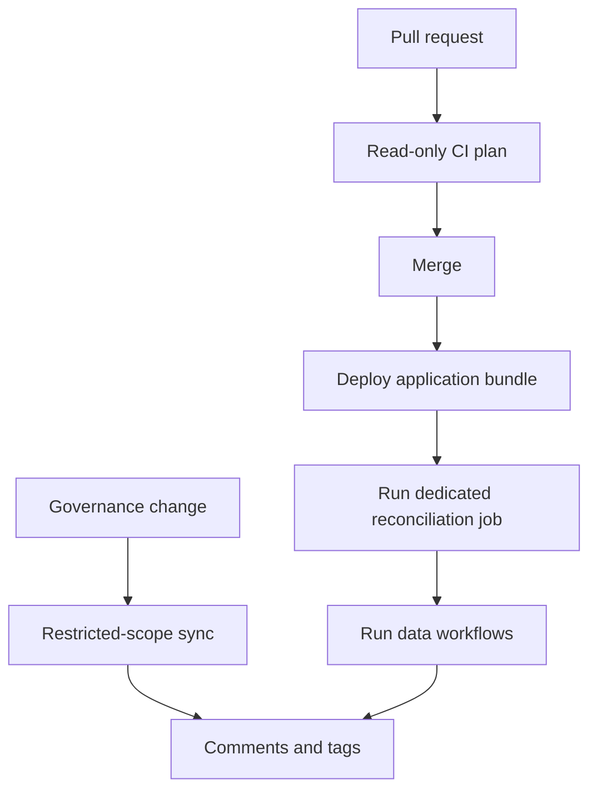

---
tags:
  - explanation
---

# Ways to use Delta Engine

Delta Engine is a reconciliation library rather than a deployment system or
background controller. A sync runs only when your application, workflow, or
deployment process calls it with a collection of table declarations.

This makes Delta Engine flexible about where it fits. A team can reconcile
table contracts as part of a release, make table readiness a prerequisite of an
ETL workflow, or manage governance metadata around tables whose structure is
owned elsewhere.

The patterns below are not mutually exclusive. A project might plan changes in
CI, apply them through a dedicated release job, and use a separate restricted
deployment for centrally managed annotations.

## Choose a pattern

| Pattern                                                                                             | Best suited to                                                       | Where Delta Engine runs                                  |
| --------------------------------------------------------------------------------------------------- | -------------------------------------------------------------------- | -------------------------------------------------------- |
| [Release table contracts with the application](#release-table-contracts-with-the-application)       | Controlled production releases and continuing table estates          | A dedicated job after the application bundle is deployed |
| [Require table readiness before ETL](#require-table-readiness-before-etl)                           | Batch data products that must establish their tables before writing  | The first task in the data workflow                      |
| [Add governance without taking over the pipeline](#add-governance-without-taking-over-the-pipeline) | Split ownership between data-product, platform, and governance teams | A separate restricted-scope deployment                   |

## Release table contracts with the application

For most production applications, the clearest pattern is to treat table
contracts as part of the release:



The declarations, pipeline code, and deployment configuration are versioned and
released together. The deployment creates or updates the Databricks resources,
then runs a dedicated job that reconciles the table declarations before the new
data-producing workload is allowed to run.

This keeps responsibilities clear:

* the bundle deploys jobs, pipelines, libraries, and configuration;
* the reconciliation job manages the declared table state;
* the ETL workloads produce and write rows.

### Keep an explicit table registry

Expose the tables owned by the release through one explicit, ordered
collection:

```python
# myproject/table_registry.py
from myproject.tables.customers import customers
from myproject.tables.order_items import order_items
from myproject.tables.orders import orders

ALL_TABLES = (
    customers,
    orders,
    order_items,
)
```

Prefer an explicit registry to automatically crawling packages for every
`DeltaTable` object. The registry makes the deployment unit visible in code
review and avoids importing arbitrary modules merely to discover declarations.
Adding a table to the registry is an intentional decision to include it in the
release.

Larger projects can expose one registry per domain:

```python
# myproject/customers/table_registry.py
CUSTOMER_TABLES = (
    customers,
    customer_preferences,
)

# myproject/orders/table_registry.py
ORDER_TABLES = (
    orders,
    order_items,
)
```

A release can then compose only the domains it owns:

```python
ALL_TABLES = (
    *CUSTOMER_TABLES,
    *ORDER_TABLES,
)
```

### Add a reconciliation entry point

Package the reconciliation logic with the application:

```python
# myproject/sync_tables.py
from delta_engine import render_report
from delta_engine.databricks import build_spark_engine
from pyspark.sql import SparkSession

from myproject.table_registry import ALL_TABLES


def main() -> None:
    """Reconcile every table owned by this release."""
    spark = SparkSession.getActiveSession()

    if spark is None:
        spark = SparkSession.builder.getOrCreate()

    engine = build_spark_engine(spark)
    report = engine.sync(*ALL_TABLES)

    print(render_report(report))
```

Expose the function as a wheel entry point:

```toml
[project.scripts]
sync-tables = "myproject.sync_tables:main"
```

The job succeeds only when the sync succeeds. If reading, planning, dependency
resolution, or execution fails, Delta Engine raises `SyncFailedError` and the
job should fail rather than allowing the release to continue silently.

### Deploy and run it through a bundle

A Declarative Automation Bundle can deploy the project wheel and define a
dedicated Python wheel task.

The resource below is intentionally abridged; add the compute, libraries,
permissions, and environment-specific settings required by your workspace:

```yaml
resources:
  jobs:
    reconcile_tables:
      name: ${bundle.target}-reconcile-tables

      tasks:
        - task_key: reconcile_tables

          python_wheel_task:
            package_name: myproject
            entry_point: sync-tables

          libraries:
            - whl: ../dist/*.whl
```

The release pipeline can then validate the bundle, deploy it, and run the
reconciliation job:

```bash
databricks bundle validate --target production
databricks bundle deploy --target production
databricks bundle run --target production reconcile_tables
```

Do not trigger the new data workload unless reconciliation succeeds.

Bundle deployment and table reconciliation are separate operations. If the
bundle is deployed but the reconciliation job fails, the new job definitions
and application artifacts may already exist in the workspace. The release
process should stop, expose the failed `SyncReport`, and prevent the updated
data workload from starting until the declaration or catalog problem is
resolved.

### Plan the same registry in CI

The same registry can be planned during a pull request through the read-only
CLI:

```bash
delta-engine plan myproject.table_registry:ALL_TABLES
```

This reads live Unity Catalog state, validates the declarations, and prints the
semantic differences and exact planned DDL without applying them.

Use separate identities for planning and application:

* a read-only identity for pull-request planning;
* a write-capable job identity for the deployment sync;
* a deployment identity responsible for publishing the bundle.

A bundle's `run_as` configuration can separate the identity that deploys the
workflow from the service principal under which the reconciliation job runs.

A real sync does not replay the dry-run output as a saved plan. It reads the
catalog again and derives a fresh plan from the state present at deployment
time. See [How to report schema plans in CI](how-to-gate-changes-in-ci.md) for
a complete read-only workflow.

## Require table readiness before ETL

A batch data product can make reconciliation the first task in its Lakeflow
Job:



Every data-producing task depends on the reconciliation task succeeding. The
workflow itself therefore enforces the precondition:

> The declared tables must be readable, valid, and successfully reconciled
> before this run writes any rows.

An abridged bundle definition might look like this:

```yaml
resources:
  jobs:
    customer_data_product:
      name: ${bundle.target}-customer-data-product

      tasks:
        - task_key: reconcile_tables

          python_wheel_task:
            package_name: myproject
            entry_point: sync-tables

          libraries:
            - whl: ../dist/*.whl

        - task_key: build_customers

          depends_on:
            - task_key: reconcile_tables

          python_wheel_task:
            package_name: myproject
            entry_point: build-customers

          libraries:
            - whl: ../dist/*.whl

        - task_key: build_orders

          depends_on:
            - task_key: reconcile_tables

          python_wheel_task:
            package_name: myproject
            entry_point: build-orders

          libraries:
            - whl: ../dist/*.whl
```

The default successful path is:

```text
reconcile_tables succeeds
        ↓
dependent ETL tasks start
```

If reconciliation fails, the dependent tasks do not run.

### When this pattern works well

Use an upstream reconciliation task when:

* the workflow and its target tables form one data product;
* the job must be able to start in an environment where a table may be absent;
* table readiness should be checked every time the workflow begins;
* the workflow is batch-oriented or runs at a moderate frequency;
* the cost of reading catalog state on each workflow run is acceptable.

It is also useful for an explicit release workflow:

```text
reconcile tables
        ↓
run deployment smoke tests
        ↓
trigger the production data job
```

The production data job can remain a separate resource while the release
workflow preserves the ordering.

### When not to use it

Do not call `sync()` for every streaming micro-batch. Re-reading and replanning
a stable table contract hundreds of times per hour adds work without improving
the contract.

For continuous or high-frequency pipelines, reconcile at release time before
the pipeline is started or updated:

```text
deploy release
        ↓
reconcile table contracts
        ↓
start or update continuous pipeline
```

Also avoid enabling writer-driven schema evolution for table aspects that
Delta Engine owns. The workflow should not simultaneously ask Delta Engine to
enforce one column structure while allowing the writer to evolve that same
structure independently.

## Add governance without taking over the pipeline

Table ownership is not always all-or-nothing. A data-product team may own the
schema and row production while a platform or governance team owns comments,
classifications, and ownership tags.

Restricted scopes let those responsibilities remain separate:



For example, a pipeline can continue to define and populate an `orders` table
while a separate declaration manages its annotations:

```python
from delta_engine.schema import Column, DeltaTable, Long, String

orders_annotations = DeltaTable(
    catalog="production",
    schema="sales",
    name="orders",
    columns=[
        Column(
            "order_id",
            Long(),
            nullable=False,
            comment="Stable identifier for an order.",
            tags={"classification": "identifier"},
        ),
        Column(
            "customer_email",
            String(),
            comment="Email supplied when the order was placed.",
            tags={"classification": "personal"},
        ),
    ],
    comment="Customer orders accepted by the commerce platform.",
    tags={
        "domain": "sales",
        "owner": "commerce-platform",
    },
    scope="annotations",
)
```

With `scope="annotations"`, Delta Engine can reconcile table and column comments
and tags, but it cannot add, remove, or alter columns, properties, layouts, or
constraints.

Other available scopes include:

| Scope         | Managed state                       |
| ------------- | ----------------------------------- |
| `full`        | Complete table definition           |
| `metadata`    | Comments, tags, and key constraints |
| `annotations` | Comments and tags                   |
| `tags`        | Tags only                           |

See [How to deploy metadata only](how-to-deploy-metadata-only.md) for the exact
scope semantics.

### Mirror the table state you do not own

A restricted declaration still describes the live table accurately. Its
columns, layout, and any keys must match the state owned by the producing
system, even though Delta Engine is not allowed to alter those aspects.

If the pipeline changes the schema and the governance declaration is not
updated, the next sync fails rather than applying metadata against a table it
no longer understands. This makes the ownership boundary safe, but it also
means governance declarations must follow intentional changes made by the
structural owner.

### Use restricted scopes for streaming tables

Databricks streaming tables are structurally owned by their defining pipeline.
Delta Engine can manage their externally alterable comments and tags through
`scope="annotations"` or `scope="tags"`, but broader scopes are rejected.

Do not declare the same comment or tag in both the pipeline definition and
Delta Engine. A pipeline refresh can reassert its own declaration, creating
recurring drift between two competing owners.

## Combine the patterns

A larger project can use all three patterns:



For example:

1. Table declarations live in a shared Python package beside the data-product
   code.
2. Pull requests plan the explicit registry through a SQL warehouse using a
   read-only identity.
3. A merged release deploys a bundle and runs a dedicated write-capable
   reconciliation job.
4. Data workflows are triggered only after reconciliation succeeds.
5. A separate governance deployment manages annotations on tables owned by
   other pipelines.

The common principle is that each table aspect has one clear owner.

## Operational boundaries

Whichever pattern you use:

* Keep one write-capable sync per table at a time.
* Treat a dry run as a live preview, not as an immutable saved plan.
* Do not allow another tool to evolve an aspect that Delta Engine manages.
* Do not run reconciliation inside every streaming micro-batch.
* Prefer explicit table registries over implicit package crawling.
* Do not describe a multi-statement table plan or multi-table run as
  transactionally atomic.
* Inspect the returned `SyncReport`; successful process startup is not a
  substitute for checking the reconciliation result.

See [Getting started](tutorial-getting-started.md) for a complete first sync,
[How a sync works](explanation-sync-lifecycle.md) for the execution model, and
[Capabilities and limitations](reference-limitations.md) before using
write-capable synchronization in an unattended production workflow.
