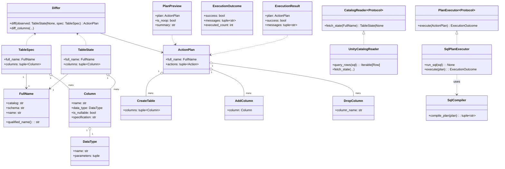

```mermaid
classDiagram
    %% Domain Value Objects
    class FullName {
      +catalog: str
      +schema: str
      +name: str
      +qualified_name(): str
    }
    class DataType {
      +name: str
      +parameters: tuple
    }
    class Column {
      +name: str
      +data_type: DataType
      +is_nullable: bool
      +specification: str
    }

    %% Domain Entities / Aggregates
    class TableSpec {
      +full_name: FullName
      +columns: tuple~Column~
    }
    class TableState {
      +full_name: FullName
      +columns: tuple~Column~
    }

    %% Domain Actions
    class CreateTable { +columns: tuple~Column~ }
    class AddColumn    { +column: Column }
    class DropColumn   { +column_name: str }
    class ActionPlan   { +full_name: FullName
                         +actions: tuple~Action~ }

    %% Domain Services
    class Differ {
      +diff(observed: TableState|None, spec: TableSpec) ActionPlan
      +diff_columns(...)
    }

    %% Application Layer
    class PlanPreview { +plan: ActionPlan
                        +is_noop: bool
                        +summary: str }
    class ExecutionOutcome { +success: bool
                             +messages: tuple~str~
                             +executed_count: int }
    class ExecutionResult { +plan: ActionPlan
                            +success: bool
                            +messages: tuple~str~ }

    %% Ports (Application)
    class CatalogReader~Protocol~ {
      +fetch_state(FullName) TableState|None
    }
    class PlanExecutor~Protocol~ {
      +execute(ActionPlan) ExecutionOutcome
    }

    %% Adapters (Outbound)
    class UnityCatalogReader {
      +query_rows(sql): Iterable[Row]
      +fetch_state(...)
    }
    class SqlCompiler {
      +compile_plan(plan): tuple~str~
    }
    class SqlPlanExecutor {
      +run_sql(sql): None
      +execute(plan): ExecutionOutcome
    }

    %% Relationships
    TableSpec "1" o-- "many" Column
    TableState "1" o-- "many" Column
    Column "1" o-- "1" DataType
    TableSpec "1" --> "1" FullName
    TableState "1" --> "1" FullName


    ActionPlan "1" o-- "many" CreateTable
    ActionPlan "1" o-- "many" AddColumn
    ActionPlan "1" o-- "many" DropColumn

    Differ <.. TableSpec
    Differ <.. TableState
    Differ --> ActionPlan

    PlanPreview ..> ActionPlan
    ExecutionResult ..> ActionPlan

    CatalogReader <|.. UnityCatalogReader
    PlanExecutor <|.. SqlPlanExecutor

    SqlPlanExecutor ..> SqlCompiler : uses
```

```mermaid
flowchart LR
  A["User code builds TableSpec"] --> B["plan_actions(spec, reader)"]
  B --> C["CatalogReader.fetch_state(full_name)"]
  C --> D["Differ.diff(observed, spec)"]
  D --> E["ActionPlan"]
  E --> F["PlanPreview (is_noop, summary)"]
  E --> G["execute_plan(spec, reader, executor)"]
  G --> H["compile_plan(ActionPlan)"]
  H --> I["SqlPlanExecutor.run_sql(sql)"]
  I --> J["ExecutionOutcome mapped to ExecutionResult"]
  F -. "optional: if not noop" .-> G

```